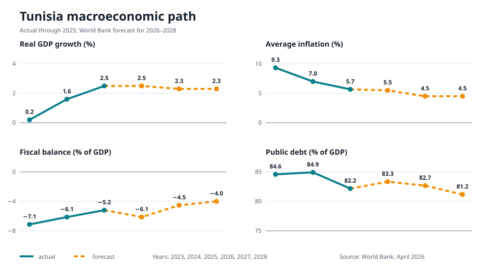
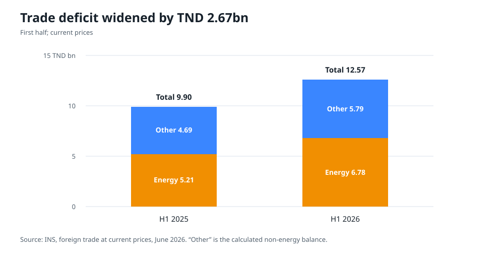
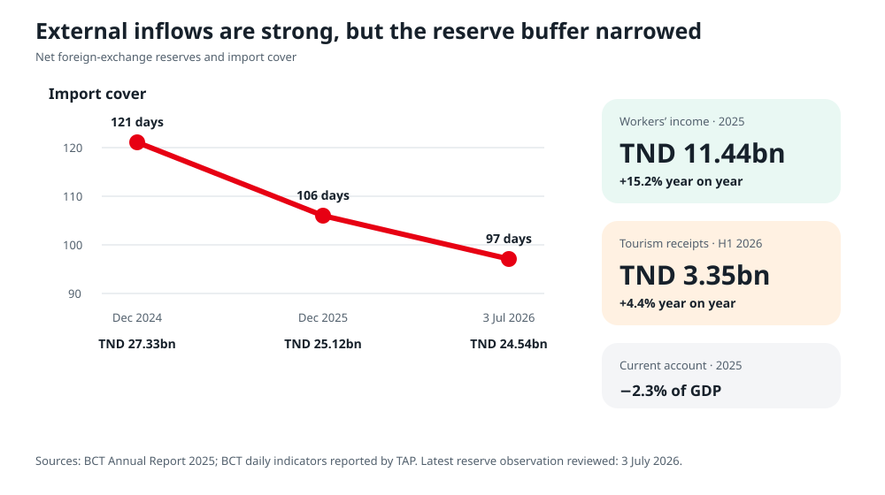
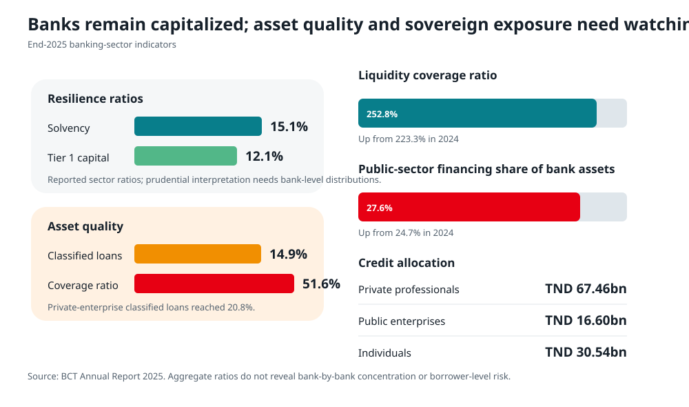

# Current economic snapshot

## Headline indicators

| Indicator | Latest actual | Interpretation |
|---|---:|---|
| Real GDP | +2.6% year on year, Q1 2026; −0.3% quarter on quarter | Recovery continues, but momentum weakened within the quarter |
| Inflation | 5.3%, June 2026 | Lower than recent peaks, but food inflation was 7.1% |
| Unemployment | 15.0%, Q1 2026 | 641,700 people unemployed |
| Youth unemployment | 37.5%, Q1 2026 | The recovery is not creating enough entry-level jobs |
| Graduate unemployment | 24.2%, Q1 2026 | Female graduate unemployment was 32.0% |
| H1 trade deficit | TND 12.57bn | Widened by TND 2.67bn year on year |
| Energy independence | 34%, Jan–May 2026 | Down from 39% a year earlier |
| Public debt | 82.1% of GDP, end-2025 provisional | High and exposed to refinancing and growth risk |
| 2025 fiscal deficit | 5.2% of GDP, World Bank estimate | World Bank forecasts 6.1% in 2026 |
| 2025 declared investment | TND 8.36bn | Intentions, not equivalent to investment executed |
| 2025 international investment | TND 3.57bn | A different, recorded-flow concept |

Sources: [INS GDP](https://www.ins.tn/publication/la-croissance-economique-au-premier-trimestre-2026), [INS prices](https://www.ins.tn/publication/indice-des-prix-la-consommation-juin-2026), [INS employment](https://www.ins.tn/publication/indicateurs-de-lemploi-et-du-chomage-premier-trimestre-2026), [INS trade](https://www.ins.tn/publication/commerce-exterieur-aux-prix-courants-juin-2026), [Energy Ministry](https://www.energiemines.gov.tn/fileadmin/docs-u1/Conjoncture_%C3%A9nerg%C3%A9tique__mai_2026.pdf), [World Bank April 2026 outlook](https://documents1.worldbank.org/curated/en/099635304152611739/pdf/IDU-5b2c845c-675f-43d2-8411-9d2c38f7624b.pdf).

## Growth: better, but below what the labor market needs

The 2.5% growth recorded in 2025 was a meaningful improvement from 1.6% in 2024. The first quarter of 2026 grew 2.6% from a year earlier, although the seasonally adjusted quarter-on-quarter result was negative. The World Bank forecasts 2.5% for 2026 and 2.3% in both 2027 and 2028. This is a recovery path, not a convergence path.

At growth near 2–2.5%, Tunisia can struggle to raise employment, service debt, maintain infrastructure and absorb new graduates at the same time. The binding problem is productivity and investment, not merely aggregate demand. A consumption- or wage-led acceleration financed by borrowing would worsen imports and fiscal pressure. A pure fiscal contraction would weaken activity and social stability. The required mix is reallocation toward reliable infrastructure and private investment, accompanied by targeted income protection.

## Prices: disinflation with persistent household pressure

June 2026 consumer inflation was 5.3%. The composition matters:

- food prices: 7.1%;
- manufactured goods: 4.7%;
- services: 4.3%;
- inflation excluding food and energy: 4.9%;
- freely priced items: 6.3%; and
- regulated prices: 1.3%.

The difference between free and regulated prices shows why an abrupt administered-price adjustment could lift inflation quickly. The food figure explains why households may not feel the same improvement as the headline index. Policy should therefore avoid using broad price suppression as the main anti-inflation tool. It should remove logistical bottlenecks, enforce competition, improve market information, reduce waste and cold-chain failures, and compensate vulnerable households directly when administered prices are adjusted.

## Employment: the core social and economic constraint

In the first quarter of 2026, the labor force participation rate was only 45.9%. Unemployment was 12.3% for men and 20.7% for women. Among university graduates it was 14.2% for men and 32.0% for women. These are not temporary differences that a small cyclical improvement will close.

Employment was concentrated in:

- services: 52.9%;
- manufacturing: 19.0%;
- agriculture and fishing: 15.7%; and
- non-manufacturing activities: 12.3%.

The policy implication is that Tunisia needs both tradable services and higher-value manufacturing. Public works can help during a slowdown, but they are not a durable graduate-employment strategy. Training should be procured against employer demand and verified placement, while transport, childcare and safe working conditions should address female participation constraints.

## External trade: energy explains more than half the deficit

Exports reached TND 34.65bn in the first half of 2026, 9.0% higher than a year earlier. Imports reached TND 47.21bn, up 13.3%. Because imports grew faster from a larger base, the coverage ratio fell from 76.2% to 73.4%.

The energy deficit was TND 6.78bn and the calculated non-energy deficit TND 5.79bn. Energy therefore represented about 54% of the total. This gives energy reform a double return: improved electricity security and reduced external vulnerability.

The European Union received 70.4% of Tunisia’s exports and supplied 44.9% of imports in the first half. Proximity and existing industrial links are advantages, but concentration also creates exposure. Diversification should mean both deeper European value-chain participation and broader African, Middle Eastern and digital-service markets.

## Reserves, interest rates and credit

The Central Bank’s annual report recorded foreign-exchange reserves of TND 25.12bn and 106 import days at end-2025, down from TND 27.33bn and 121 days at end-2024. The latest reviewed daily observation was TND 24.54bn and 97 days on 3 July 2026. The policy rate had been reduced twice during 2025 to 7% by year-end, but financing conditions remain constrained by sovereign borrowing, risk and bank balance sheets.

Outstanding loans to the economy reached TND 122.95bn at end-2025. Banking-sector solvency was 15.1% and the liquidity coverage ratio 252.8%, but classified loans reached 14.9%. Public-sector financing increased to 27.6% of bank assets, credit to public enterprises rose to TND 16.60bn, and Treasury bills held by banks reached TND 25.71bn.

The aggregate loan stock does not show whether new credit is reaching productive firms on suitable terms. The key monitoring indicators are new private credit excluding public enterprises, average maturity, collateral requirements, rejection rates and the share going to exporting and job-creating firms.

Sources: [BCT Annual Report 2025](https://www.bct.gov.tn/bct/siteprod/documents/RA_2025_fr.pdf), [TAP on reserves, 3 July 2026](https://www.tap.info.tn/en/Portal-Headlines/20357134-forex-reserves-drop), [TAP on bank lending](https://www.tap.info.tn/en/Portal-Headlines/20369052-bct-report).

## Baseline and forecast must not be mixed

The forecast table below is useful for stress-testing, not a government commitment:

| Indicator | 2025 estimate | 2026 forecast | 2027 forecast | 2028 forecast |
|---|---:|---:|---:|---:|
| Real GDP growth | 2.5% | 2.5% | 2.3% | 2.3% |
| Average inflation | 5.7% | 5.5% | 4.5% | 4.5% |
| Fiscal balance | −5.2% of GDP | −6.1% | −4.5% | −4.0% |
| Public debt | 82.2% of GDP | 83.3% | 82.7% | 81.2% |
| Current account | −2.4% of GDP | −3.7% | −2.9% | −3.0% |
| Net FDI | 1.6% of GDP | 1.8% | 1.7% | 1.8% |

The fiscal deficit is forecast to fall after 2026, but the current-account deficit remains near 3% of GDP in 2027–2028 and external financing needs persist. If growth, tourism, remittances, energy prices or project disbursements disappoint, debt and reserve outcomes will be worse. This is why the recovery program uses explicit downside triggers rather than one central forecast.
