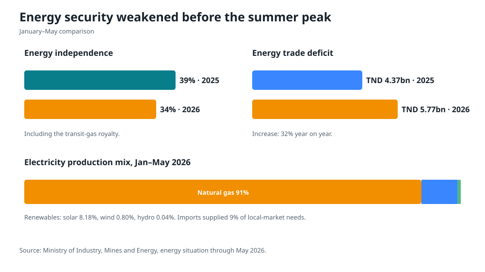

# Power system and the July 2026 outages

## What is known

During the July heatwave, STEG announced possible localized, rotating interruptions during high-demand evening periods in several governorates. Official reporting described the measure as a way to preserve network stability when the system reached a red-alert condition. On 24 July, STEG denied a circulating claim that a general nationwide blackout was planned.

The evidence supports three careful conclusions:

1. Tunisia experienced deliberate load shedding and local interruptions during peak stress.
2. The stated immediate objective was to prevent a larger instability or collapse.
3. Public sources reviewed for this dossier do not provide a complete real-time record of available generation, forced outages, reserve margin, unserved energy or interruption duration by feeder.

That third point matters. Without a public operational dataset, it is impossible to separate, for each event, insufficient generation, network congestion, equipment faults, import constraints and local distribution failures. Claims that one specific plant or fuel interruption caused all outages should therefore be treated cautiously unless STEG publishes the event data.

Sources: [TAP, 18 July](https://www.tap.info.tn/fr/Portail-Titres-de-l-actualit%C3%A9/20404822-canicule-coupures), [TAP, 19 July](https://www.tap.info.tn/fr/Portail-%C3%A0-la-Une-FR-top/20407107-la-steg-annonce), [TAP, 24 July denial](https://www.tap.info.tn/fr/Portail-Titres-de-l-actualit%C3%A9/20424483-la-steg-d%C3%A9ment-la), [STEG press releases](https://www.steg.com.tn/fr/page/communiqu%C3%A9s-de-presse).

## Why the system is vulnerable

### 1. High dependence on natural gas

Natural gas supplied about 91% of domestic electricity production through May 2026. Solar supplied 8.18%, wind 0.80% and hydro 0.04%. This concentration means that domestic gas production, pipeline gas, fuel prices, payment capacity and gas-fired plant availability affect nearly the entire system at once.

Primary energy resources fell from 1.429 to 1.306 million tonnes of oil equivalent in the first five months of 2026, while demand rose from 3.706 to 3.843 Mtoe. The energy deficit widened 12%, and the independence ratio fell from 39% to 34%. Excluding the transit-gas royalty, the ratio was lower.

### 2. Imports provide support but not full insurance

Electricity available to the local market reached 8.26 TWh through May, up 4%. Imports from Algeria and Libya were 0.722 TWh, down 15%, and covered about 9% of local-market needs. Interconnection is valuable, but neighboring systems can also be tight during a regional heatwave. Tunisia must plan domestic firm capacity and demand flexibility rather than assuming imports will always be available at the peak.

### 3. Solar output and evening demand are not naturally aligned

Solar capacity is growing, including household and commercial self-generation. This lowers daytime fuel use, but the most difficult summer hours can continue after solar output declines. Without batteries, flexible generation, demand response, thermal storage or time-shifting, new solar alone does not guarantee an evening reserve margin.

### 4. Grid constraints and losses reduce usable capacity

Nameplate generation is not the same as deliverable power. Transmission constraints, overloaded substations, transformer failures, technical losses, theft, inaccurate meters and weak maintenance can turn an adequate national energy balance into local shortages. TEREG’s focus on transmission, distribution, digital systems and STEG finances is therefore as important as new generation.

### 5. STEG’s financial weakness becomes an operational risk

The utility must buy fuel and imported electricity, maintain plants and networks, pay contractors, invest in new assets and collect from customers. The 2024 average electricity selling price reported by the Energy Ministry was about 290.3 millimes/kWh versus an average cost of 481.3 millimes/kWh. This accounting gap is not automatically equal to the fiscal subsidy, but it shows that tariffs, government compensation, costs and collections do not form a sustainable closed system.

Parliamentary discussions in 2026 also reported very large STEG debt and unpaid receivables. Because the reviewed official parliamentary summaries did not reproduce every figure, this dossier does not use those amounts as a confirmed audited balance. The proper response is an independently reconciled opening balance sheet, not argument over unverified totals.

## The emergency reliability plan

### Within 30 days

| Action | Owner | Required public output |
|---|---|---|
| Establish a national electricity reliability cell | Energy Ministry and STEG | Daily 18:00 dashboard |
| Forecast next-day peak and available capacity | STEG system operator | Peak, available MW, imports and reserve |
| Publish load-shedding protocol | STEG | Trigger, rotation, maximum duration and protected loads |
| Verify critical-site backup | Health, Water, Interior, Telecom, municipalities | Site-by-site pass/fail register |
| Freeze nonessential planned maintenance during critical windows | STEG | Maintenance exceptions and rationale |
| Inventory critical spares | STEG | Procurement list, stock gap and delivery date |
| Contract voluntary demand response | STEG and large users | MW committed, strike price and activations |
| Open outage reporting | STEG | Machine-readable event log by governorate and feeder |

The daily dashboard should report:

- forecast and actual peak demand;
- total technically available generation;
- unavailable capacity by planned and forced cause;
- contracted and actual imports;
- operating reserve before the peak;
- demand response called and delivered;
- load shed in MW, MWh and customer-minutes;
- major transmission or substation constraints; and
- restoration performance.

Publishing this information does not create electricity, but it changes management behavior, improves accountability, lets large users respond and reduces harmful rumor.

### Within 100 days

1. Complete a rapid engineering audit of the ten most consequential plants, substations and transmission constraints.
2. Repair or replace components with the highest expected reduction in unserved energy per dinar.
3. Procure seasonal demand response from cement, refrigeration, pumping, commercial cooling and other flexible loads. Participation should be voluntary and paid for verified performance.
4. Pilot time-of-use tariffs for large users with interval meters. Do not expose households without smart meters to complex dynamic tariffs.
5. Install solar-plus-storage at critical hospitals, water facilities, telecom and civil-protection sites, sized for critical loads rather than whole-site consumption.
6. Launch a high-efficiency cooling program: minimum standards, appliance labeling, concessional replacement for inefficient units, cool roofs and public-building controls.
7. Reconcile public-sector electricity bills and establish installment plans. Essential public services should not be disconnected without a continuity plan.

### Before summer 2027

- Complete the first loss-reduction and substation reinforcement package.
- Put a functioning outage-management system in the highest-risk distribution areas.
- Meter all large and public-sector customers accurately.
- Secure firm reserve for the forecast peak through available generation, storage, imports and contracted demand response.
- Test controlled load shedding before the summer, including communications and critical-load protection.
- Publish a post-summer 2026 incident review and the closure status of every recommendation.

## Structural electricity reform

### Build a least-cost portfolio, not a technology slogan

The portfolio should combine:

- competitive solar and wind;
- battery storage for ramping and peak support;
- transmission and distribution reinforcement;
- flexible thermal capacity retained where needed for security during the transition;
- demand response and time-shifting;
- efficiency in cooling, pumping, buildings and industry;
- cross-border interconnection; and
- accurate metering and loss reduction.

The Bazma–Kebili tender is strategically relevant because it combines 300 MW of solar with a 150 MW/540 MWh battery. Tunisia should evaluate the bid on delivered system value, connection readiness, availability obligations, degradation, fire safety, local capability and contingent fiscal exposure, not only the lowest energy price.

Sources: [Energy Ministry Bazma tender](https://www.energiemines.gov.tn/fr/tc/annonce/news/appel-doffres-n01-2026-centrale-photovoltaique-avec-systeme-bess-de-bazma-kebili/?cHash=ae197e6bad59bc4e31b005dcb4c54d3b&tx_news_pi1%5Baction%5D=detail&tx_news_pi1%5Bcontroller%5D=News), [sixth 200 MW authorization round](https://www.energiemines.gov.tn/fr/tc/annonce/news/avis-dappel-a-projets-de-production-delectricite-a-partir-de-lenergie-solaire-photovoltaique-ass/?cHash=07cff6fc2d9d4495bc8564bbfa23f3ec&tx_news_pi1%5Baction%5D=detail&tx_news_pi1%5Bcontroller%5D=News).

### Use TEREG as the reform contract

The World Bank approved a five-year US$430m Tunisia Energy Reliability, Efficiency and Governance Improvement Program, including US$30m of concessional Climate Investment Funds resources. Its official ambition is to mobilize US$2.8bn in private investment, add 2.8 GW of solar and wind by 2028, create more than 30,000 construction jobs, reduce electricity supply costs by 23%, raise STEG cost recovery from 60% to 80%, and reduce subsidies by TND 2.045bn.

These are program targets, not achieved results. Parliament approved the relevant state-guarantee agreements in July 2026. Disbursement should be linked to verified operational and governance milestones:

- outage and loss data published;
- connection queue and grid plan operational;
- financial statements and government compensation reconciled;
- competitive procurement completed;
- vulnerable-household protection functioning;
- project land and environmental issues resolved; and
- new capacity connected and available, not merely contracted.

Sources: [World Bank TEREG announcement](https://www.worldbank.org/en/news/press-release/2025/11/11/world-bank-approves-new-project-to-power-tunisia-s-energy-transformation), [World Bank appraisal documents](https://documents.worldbank.org/en/publication/documents-reports/documentdetail/099041025150537909), [ARP approval](https://www.arp.tn/blog/1/post/14-2026-9717).

### Make tariffs social and economically coherent

A workable sequence is:

1. identify eligible low-income households and test payment delivery;
2. establish a lifeline consumption block;
3. meter large users and public bodies accurately;
4. introduce time-of-use pricing for capable large users;
5. reduce cross-subsidies and broad price gaps gradually;
6. transfer a defined share of savings to targeted support; and
7. publish tariff cost components and service-quality obligations.

Tariff changes should pause automatically if the transfer system fails, service continuity materially deteriorates, or energy poverty rises above the agreed safeguard threshold.

### Clarify roles and regulation

STEG currently combines many functions and public-service obligations. Tunisia does not need to privatize the utility to improve performance. It does need:

- an independent regulator;
- separate accounts for generation, transmission, distribution and public-service obligations;
- transparent grid access and connection rules;
- competitive procurement where feasible;
- audited performance contracts; and
- a government budget line for any obligation imposed below cost.

## ELMED: opportunity with safeguards

ELMED is a planned 600 MW high-voltage interconnector with roughly 200 km of submarine cable between Tunisia and Italy. Published cost estimates range from about €850m to €920m depending on date and scope. Team Europe announced €472.6m of support, and the World Bank approved US$268.4m for the Tunisia–Italy electricity integration project.

ELMED can:

- improve access to balancing and reserve;
- support larger renewable deployment;
- create an export route when Tunisia has surplus low-cost power;
- integrate technical standards and markets; and
- reduce curtailment.

It also creates risks: cost escalation, foreign-currency exposure, construction delay, and the political concern that power could be exported while local supply is tight. The operating rule should be explicit: protected domestic reliability and contracted reserves come first during scarcity; exports occur from surplus or under reciprocal security arrangements. All capacity-allocation rules and public contingent liabilities should be disclosed.

Sources: [EIB Team Europe package](https://www.eib.org/en/press/all/2024-205-team-europe-commits-eur472-million-to-support-the-elmed-electricity-project-and-its-ecosystem), [World Bank financing](https://www.worldbank.org/en/news/press-release/2023/06/22/world-bank-approves-268-million-project-linking-tunisia-s-energy-grids-with-europe), [EBRD project](https://www.ebrd.com/home/work-with-us/projects/psd/54389.html).

## Proposed power-sector targets

| Metric | Baseline | Proposed target |
|---|---:|---:|
| Public outage event log | Not found in reviewed public sources | Live within 100 days |
| Peak-day reserve reporting | Not found | Daily in summer 2027 |
| Large/public customer interval metering | Establish baseline | 100% by end-2028 |
| Distribution losses | Publish audited baseline | Reduce at least 2 percentage points by 2028 |
| Cost recovery | TEREG baseline 60% | TEREG target 80% |
| New solar and wind | Program baseline | TEREG target +2.8 GW by 2028 |
| Renewable share of production | About 9% through May 2026; TEREG uses a 5.6% program baseline | 27% by 2028 under the official TEREG target |
| Critical sites with tested backup | Establish baseline in 30 days | 100% before summer 2027 |
| Customer-minutes interrupted | Establish 2026 baseline | −50% by 2028 |

The final two reduction targets are policy proposals. They should be revised after audited baselines are available. The TEREG 5.6% baseline and the roughly 9% January–May 2026 production share refer to different measurement periods or program definitions and should not be treated as a continuous like-for-like series without reconciliation.
