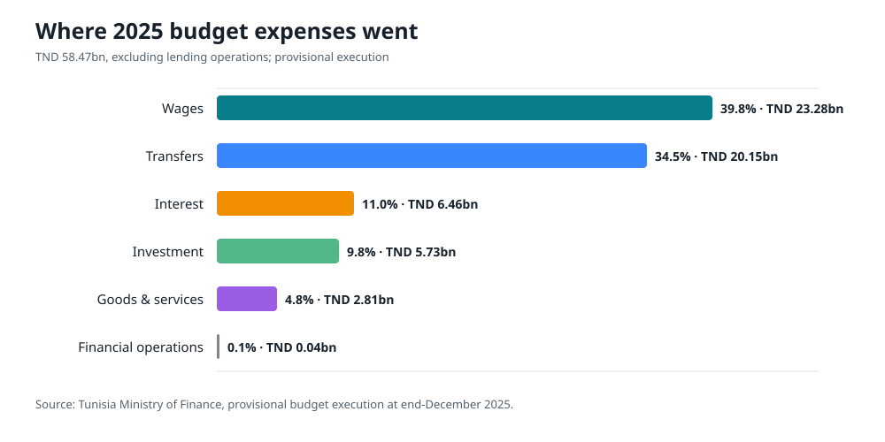
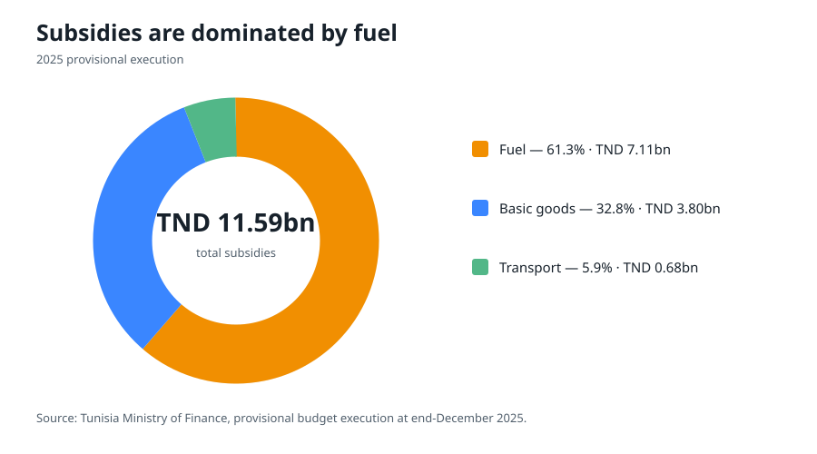
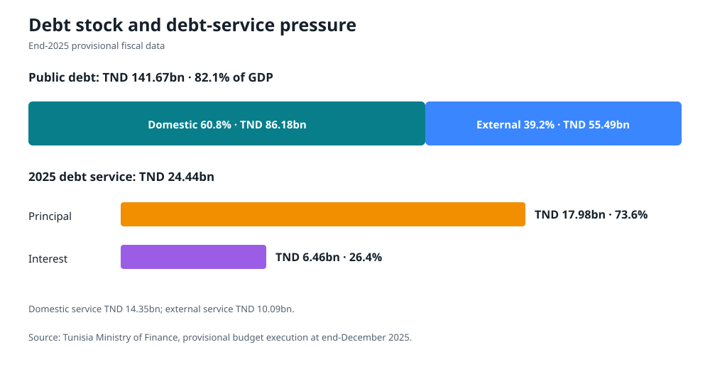

# Public finance, expenses, debt and loans

## How much the state spent in 2025

The Ministry of Finance’s provisional end-December execution reports TND 58.47bn in budget expenditure excluding lending operations. This is the most recent realized composition available for this dossier.

| Economic category | TND bn | Share |
|---|---:|---:|
| Wages | 23.281 | 39.8% |
| Transfers and interventions | 20.152 | 34.5% |
| Interest | 6.459 | 11.0% |
| Investment | 5.730 | 9.8% |
| Goods and services | 2.809 | 4.8% |
| Financial operations | 0.041 | 0.1% |
| **Total excluding lending** | **58.471** | **100.0%** |

Three-quarters of expenditure went to wages and transfers. Interest consumed slightly more than investment. This does not mean wages and transfers are economically useless: they finance public services, pensions, support and subsidies. It means the budget has little flexible room when revenue or financing disappoints.

## What subsidies covered

Within transfers and interventions, provisional subsidies totaled TND 11.593bn.

Fuel represented 61.3% of the subsidy total, basic goods 32.8% and transport 5.9%. Broad fuel support is fiscally expensive, benefits households unequally and reinforces import exposure. Removing it immediately would raise prices, transport costs and poverty. The correct reform is a sequenced exchange:

1. establish the beneficiary registry and payment method;
2. pay a compensating transfer before the price change;
3. adjust prices gradually and predictably;
4. retain a lifeline energy block and public-transport support;
5. monitor household energy burden, food prices and service use; and
6. allocate savings transparently among protection, debt reduction and investment.

If payment coverage or accuracy falls below the safeguard threshold, the next price adjustment should be postponed.

## The 2026 budget and why totals differ

The 2026 Finance Law authorizes:

- TND 52.560bn in budget revenue:
  - TND 47.773bn tax revenue;
  - TND 4.437bn non-tax revenue; and
  - TND 0.350bn grants.
- TND 63.575bn in budget expenditure.
- TND 27.064bn in cash and borrowing resources:
  - TND 6.808bn external borrowing;
  - TND 19.056bn domestic borrowing; and
  - TND 1.200bn Treasury resources.

The uses of this financing include:

- TND 11.015bn budget financing;
- TND 7.932bn domestic principal repayment;
- TND 7.917bn external principal repayment; and
- TND 0.200bn Treasury loans and advances.

The Ministry’s headline total state budget of TND 79.624bn includes debt and Treasury operations, while the TND 63.575bn figure is budget expenditure. The two should not be described as contradictory or compared without their definitions.

Source: [2026 Finance Law, Law no. 2025-17](https://www.finances.gov.tn/sites/default/files/2026-01/115725.pdf), [Ministry of Finance budget summary](https://www.finances.gov.tn/fr?Itemid=449&id=298&lang=ar-AA&option=com_content&view=article).

## Debt stock and service

At end-2025, provisional public debt was TND 141.665bn, or 82.1% of GDP:

- domestic debt: TND 86.178bn, 60.8%;
- external debt: TND 55.487bn, 39.2%.

The composition challenges a common simplification. Tunisia is not mainly dependent on international bond markets: domestic debt is the larger share, and only 8.3% of external debt was owed to financial markets. Multilateral creditors represented 68.9% of external debt and bilateral creditors 22.8%.

External currency exposure was concentrated in the euro:

- euro: 63.7%;
- US dollar: 23.4%;
- Japanese yen: 6.0%;
- other currencies: 6.9%.

Debt service in 2025 was TND 24.442bn:

- principal: TND 17.983bn;
- interest: TND 6.459bn;
- domestic service: TND 14.354bn; and
- external service: TND 10.087bn.

The near-term pressure therefore comes from maturities and cash flow as well as the interest bill. Refinancing a principal payment with new borrowing can keep debt service high even when the deficit falls.

Source: [Ministry of Finance fiscal publications](https://www.finances.gov.tn/fr/cadre-reglementaire-2), provisional budget execution at end-December 2025.

## Loans and financing: what they are doing

### Sovereign budget financing

The 2026 Finance Law relies more heavily on domestic than external borrowing. This increases the risk of crowding out private credit and concentrating sovereign exposure in local banks. Domestic funding reduces direct exchange-rate risk, but it is not free: it can raise rates, shorten maturities and tie bank balance sheets to the state.

### Direct central-bank financing

Article 12 of the 2026 Finance Law authorizes an exceptional zero-interest Central Bank facility of up to TND 11bn, repayable over 15 years with a three-year grace period, as an exception to article 25 of the Central Bank statute.

This reduces near-term cash pressure, but it does not remove the underlying fiscal cost. If used repeatedly or without sterilization, monetary financing can increase inflation, pressure reserves, weaken the dinar and reduce confidence in monetary policy. Required safeguards should include:

- monthly publication of drawdowns, uses and repayments;
- a legal aggregate ceiling and expiry;
- no use for new permanent recurrent programs;
- an explicit liquidity-management and exit plan;
- parliamentary review of inflation and reserve effects; and
- restoration of the ordinary statutory prohibition after the transition.

### Project and policy loans

Concessional and long-maturity project loans can improve debt sustainability when they finance assets with high economic returns and disburse on schedule. Current major examples include:

- TEREG: US$430m including US$30m concessional climate finance, with state guarantees approved in July 2026;
- World Bank water program: US$332.5m for the first phase;
- ELMED: financing from the World Bank, EU, EIB, EBRD, KfW and others;
- Bizerte bridge: EIB and AfDB financing;
- phosphate-rail rehabilitation: Arab Fund loan agreement approved by Parliament; and
- EBRD and partner financing for renewable generation and green credit.

A signed loan is not a benefit by itself. The net benefit is:

`economic value of delivered services − construction and operating cost − financing and risk cost`.

Loans for slow projects create commitment fees, exchange exposure and debt without timely output. Each project should therefore disclose disbursement, physical progress, variation orders, expected completion, operating budget and realized benefits.

## The fiscal strategy

### Short term: regain control without cutting the recovery

- Publish a rolling 13-week cash plan.
- Publish arrears by ministry, municipality and public enterprise.
- Stop adding new unpriced guarantees.
- Protect critical maintenance and high-readiness investment.
- Defer projects with unresolved land, design, procurement or operating plans.
- Reconcile public-enterprise cross-debts.
- Pre-fund targeted transfers before subsidy adjustments.
- Use windfall revenue above forecast primarily for arrears and debt reduction.

### Medium term: change the composition of adjustment

The adjustment should come from:

- targeted rather than generalized subsidies;
- better tax compliance, e-invoicing and data matching;
- reduced tax exemptions and published tax expenditures;
- public-enterprise performance and explicit public-service compensation;
- payroll attrition, redeployment and control of allowances rather than abrupt layoffs;
- lower procurement leakage and change-order costs;
- fewer low-return projects; and
- stronger growth and formalization.

It should not come mainly from:

- across-the-board cuts to maintenance;
- accumulating arrears;
- holding regulated prices below cost without budget compensation;
- squeezing high-return public investment;
- repeated tax amnesties;
- compulsory bank financing; or
- recurrent monetary financing.

### Medium-term fiscal anchors

These are proposed policy anchors, not official forecasts:

| Anchor | 2026–2027 | 2028 | 2030 |
|---|---:|---:|---:|
| Public debt | Stabilize below 84% of GDP | Clear declining path | Below 78% |
| Overall deficit | Crisis-sensitive ceiling with published correction | Below 4% of GDP | Toward 3% |
| New guarantees | Within statutory cap and risk-assessed | Declining net exposure | Risk-priced portfolio |
| Capital and maintenance | Protected floor | At least 15% of primary expenditure, subject to classification audit | Sustained |
| Arrears | Full stock published | Reduce verified stock by at least 50% | Normal payment terms |

The investment floor is a proposal and should be refined after a classification audit. Spending labeled “investment” should only qualify if it creates or renews an asset with an operating and maintenance plan.

## Debt-management actions

1. Publish an annual debt strategy with currency, maturity, rate and refinancing-risk ranges.
2. Exchange short domestic maturities for longer instruments where market conditions permit.
3. Build a transparent domestic yield curve rather than placing opaque instruments.
4. Prioritize concessional external finance for import-saving, export-earning and resilience projects.
5. Use hedging only where the instrument is understood, priced and disclosed.
6. Develop non-bank domestic savings channels to reduce concentration in banks.
7. Consider a diaspora infrastructure bond only for a ring-fenced, audited project portfolio; do not market it as patriotic budget support.
8. Publish a sovereign guarantee registry and probability-weighted expected loss.
9. Perform annual stress tests for slower growth, higher energy prices, a weaker dinar and public-enterprise calls.

## Small 2026 financing lines: useful but not macro reform

The Finance Law includes targeted lines such as TND 15m for disadvantaged regions, TND 35m for community companies, TND 10m for SME working capital, TND 23m for interest-free self-financing without collateral, and TND 10m for small farmers. It also provides interest support for qualifying productive SME investment loans.

These measures may help specific beneficiaries, but their scale is small relative to credit demand and public borrowing. They should be evaluated on repayment, survival, jobs, additionality and geographic access. A subsidized loan that would have been made anyway is not additional investment.
