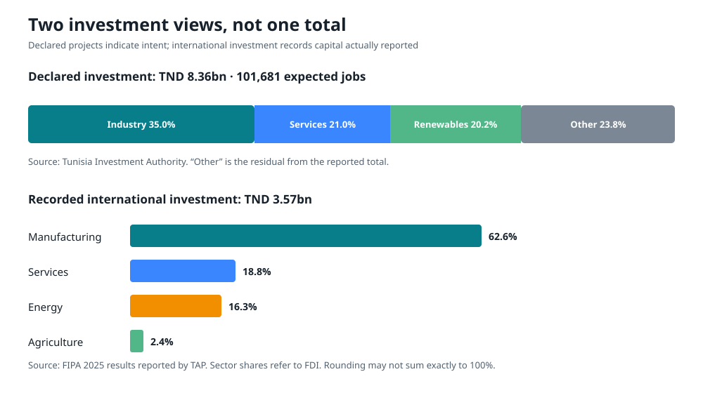
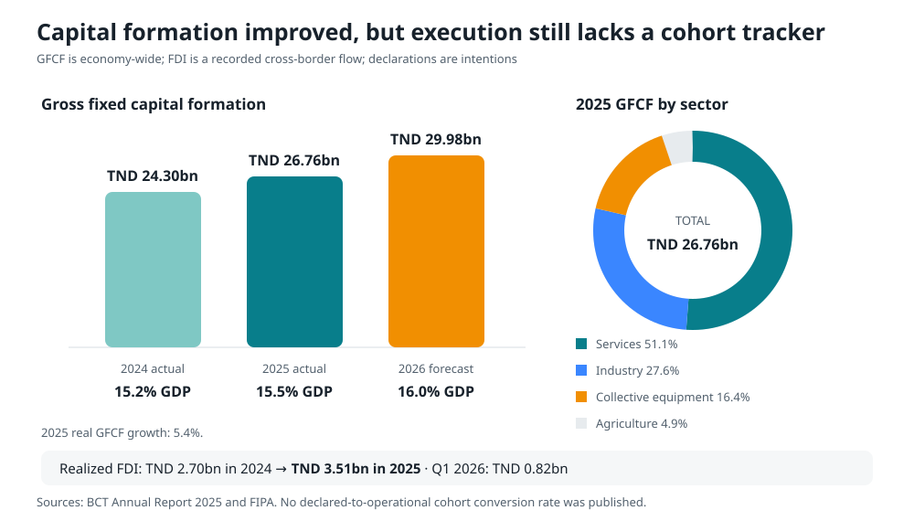

# Investment and major projects

## What the investment figures mean

Tunisia Investment Authority reported TND 8.356bn of declared investment in 2025, 39.3% more than in 2024, associated with 101,681 expected jobs. Services accounted for TND 1.755bn, industry TND 2.925bn and renewable energy TND 1.685bn. About 74% of projects were new creations.

Separately, international investment reported for 2025 reached TND 3.572bn. Within FDI, manufacturing represented 62.6%, services 18.8%, energy 16.3% and agriculture 2.4%. New foreign projects and expansions were also reported with expected jobs.

These figures answer different questions:

- **Declared investment** shows projects registered or announced.
- **Recorded international investment** measures reported cross-border flows under its own methodology.
- **Gross fixed capital formation** measures investment in the national accounts.
- **Project finance approved** shows that a lender or donor authorized funding.
- **Capital expenditure executed** shows government payments.
- **Physical completion** shows assets delivered.

They must not be added to create one “total investment” number. The policy priority is to publish conversion rates: declaration to permit, permit to financial close, financial close to construction, and construction to operation.

Sources: [TIA 2025 declared investment](https://tia.gov.tn/en/news-details/tunisie-croissance-de-393-des-investissements-declares-en-2025), [TIA annual bulletin](https://tia.gov.tn/storage/app/media/00_All_TunisiaInvestmentAuthority_2026/Stats/BULLETIN%20ANNUEL%202025.pdf), [FIPA results reported by TAP](https://www.tap.info.tn/en/Portal-Top-News-EN/19985964-tunisia-over-tnd).

## Capital formation and realized FDI

Gross fixed capital formation reached TND 26.76bn in 2025, up 5.4% in real terms, and the investment rate increased to 15.5% of GDP. The BCT forecasts TND 29.98bn and a 16.0% investment rate in 2026. Services represented 51.1% of 2025 GFCF, industry 27.6%, collective equipment 16.4% and agriculture 4.9%.

Realized FDI rose from TND 2.70bn in 2024 to TND 3.51bn in 2025. First-quarter 2026 FDI reached TND 824.4m, up 17.2% year on year. The missing measure is a cohort conversion rate that follows the same declared projects through operation; dividing total FDI by total declarations would mix different concepts and projects.

Sources: [BCT Annual Report 2025](https://www.bct.gov.tn/bct/siteprod/documents/RA_2025_fr.pdf), [FIPA Q1 2026 results reported by TAP](https://www.tap.info.tn/fr/Portail-%C3%A0-la-Une-FR-top/20168744-hausse-des).

## Major-project portfolio

### Classification

This dossier uses four statuses:

- **operational:** commissioned and producing service;
- **under construction or implementation:** works or delivery activities are active;
- **financed or procurement active:** finance is approved or tenders are active, but completion is not implied;
- **strategic pipeline or preparation:** a government priority or concept still requiring design, finance, permits or procurement.

### Portfolio table

| Project | Sector | Status at cut-off | Scale and purpose | Main delivery issue |
|---|---|---|---|---|
| TEREG | Electricity | Finance and guarantee approved; implementation program | US$430m public package; official target to mobilize US$2.8bn private capital and add 2.8 GW by 2028 | Reform and network milestones must convert into connected capacity and reliability |
| ELMED | Electricity | Under implementation | 600 MW Tunisia–Italy interconnector; about 200 km submarine cable | Cost, timing, domestic reliability rules and market integration |
| Renewable auction pipeline | Electricity | Awarded or tendering | Several 100 MW projects; Bazma 300 MW solar plus 150 MW/540 MWh battery | Land, permits, grid connection, bankable contracts |
| Kairouan solar | Electricity | Operational since December 2025 | 120 MWp | Performance, grid integration and replication |
| Bizerte bridge | Transport | Under construction | 2.07 km bridge; roughly TND 750m project estimate | Schedule, interfaces, local roads and urban access |
| Water Security and Resilience Program | Water | World Bank approved April 2026 | US$332.5m first phase; US$700m ten-year envelope | Procurement, utility performance, leakage reduction and tariff/social balance |
| Zarat desalination expansion | Water | Financed under program | Capacity from 50,000 to 100,000 m³/day | Energy cost, brine management and network losses |
| Phosphate rail rehabilitation | Rail/mining | Loan agreement approved by Parliament | Restore phosphate logistics; amount not stated in reviewed parliamentary summary | Operational reform, maintenance and environmental safeguards |
| PMIR III roads | Roads | Procurement active | Reviewed notice covers 69.3 km in Kef and Kasserine | Contract execution and maintenance |
| Sfax–Kasserine dual carriageway | Roads | Financing announced/preparation | €210m EIB financing announced | Confirm procurement, scope and readiness |
| North–South high-speed rail | Transport | Strategic pipeline/preparation | National connectivity concept | Demand, affordability, phasing and alternatives |
| Tunis–Carthage airport expansion | Aviation | Strategic pipeline/preparation | Target capacity 18.5m passengers by 2030 | Demand case, terminal design, access and funding |
| Enfidha deep-water port/logistics zone | Port/logistics | Strategic pipeline/preparation | About 3,000 hectares; official projection of 52,000 jobs | Cargo demand, environmental impact, connectivity and financing |

The project dataset is available in [CSV form](data/major_projects.csv).

## Projects with the strongest near-term economic case

### 1. Grid reliability, renewable integration and storage

These projects reduce outages, imported fuel and production costs. They also unlock private generation investment. The economic case is strongest when network capacity and connection certainty are delivered before or with generation.

The Kairouan 120 MWp solar project was commissioned in December 2025. Sidi Bouzid and Tozeur solar capacity entered operation in 2026 according to the Energy Ministry’s May report, while additional 100 MW-class projects were at agreement, award or development stages. The main risk is a portfolio of signed generation contracts waiting for land, permits or connection.

Sources: [AfDB Kairouan commissioning](https://www.afdb.org/en/news-and-events/press-releases/tunisia-african-development-bank-welcomes-commissioning-120-mwp-kairouan-solar-photovoltaic-project-major-milestone-89873), [Energy Ministry May 2026 report](https://www.energiemines.gov.tn/fileadmin/docs-u1/Conjoncture_%C3%A9nerg%C3%A9tique__mai_2026.pdf).

### 2. Water security and distribution efficiency

The World Bank approved US$332.5m for the first phase of a ten-year, US$700m program in April 2026. The phase includes:

- US$124m for irrigation improvements in Jendouba, Béja, Bizerte and Siliana;
- US$208.5m for potable water;
- doubling Zarat desalination capacity from 50,000 to 100,000 m³/day;
- network rehabilitation and 100,000 smart meters;
- an estimated 2.3 million beneficiaries; and
- project estimates of about 4,000 permanent and 13,000 temporary jobs.

Desalination without network-loss reduction can produce expensive water that leaks. It also raises electricity demand. The project should therefore report energy per cubic meter, renewable supply share, leakage, service continuity, brine compliance and affordable access.

Source: [World Bank water program, 1 April 2026](https://www.worldbank.org/en/news/press-release/2026/04/01/tunisia-major-push-to-strengthen-water-security-and-resilience).

### 3. Bizerte bridge and connecting roads

The Bizerte project includes a 2.07 km bridge with a height of about 56 meters and associated roads. Published project estimates were roughly TND 750m, including a TND 610m main construction contract. The EIB committed €123m and the AfDB €122m. The bridge can reduce a significant urban and port bottleneck, but benefits depend on connecting-road completion, traffic management and urban integration.

Sources: [EIB project release](https://www.eib.org/en/press/all/2024-130-l-europe-soutient-la-construction-du-nouveau-pont-a-bizerte-afin-d-ouvrir-de-nouvelles-perspectives-economiques-pour-la-region), [AfDB project status](https://www.afdb.org/fr/projects-and-operations/p-tn-db0-016).

### 4. Phosphate rail rehabilitation

Restoring rail capacity can lower logistics cost, reduce road damage and help recover export earnings. Parliament approved the loan agreement with the Arab Fund in April 2026. The project should not be evaluated only by tonnes moved. It needs:

- transparent rehabilitation milestones;
- maintenance funding and rolling-stock availability;
- environmental and worker-safety compliance;
- efficient interfaces among the phosphate company, railway and port; and
- published production and transport bottlenecks.

Sources: [ARP project file](https://www.arp.tn/loi/project/4250), [ARP plenary summary](https://www.arp.tn/blog/1/post/21-2026-9565).

## Strategic projects that need stronger appraisal

The government has prioritized a North–South high-speed rail line, an airport rail link, Tunis–Carthage airport expansion and the Enfidha deep-water port/logistics zone. These may be valuable, but they remain pipeline concepts or preparations in the reviewed official announcements.

Source: [Prime Ministry strategic-project council](https://www.pm.gov.tn/fr/article/conseil-ministeriel-restreint-appel-lacceleration-de-la-realisation-de-grands-projets).

Before procurement, each should pass an independent gateway:

1. **Strategic need:** what problem is being solved?
2. **Alternatives:** can upgrades, pricing, digital management or phased capacity solve it more cheaply?
3. **Demand:** what is the conservative utilization forecast?
4. **Economic return:** include time, safety, emissions, resilience and regional effects.
5. **Fiscal affordability:** include construction, operations, guarantees, land and foreign exchange.
6. **Readiness:** design, geotechnical work, land, resettlement, permits and utility relocation.
7. **Climate and water:** include lifecycle and adaptation risk.
8. **Procurement route:** public procurement, concession or PPP based on risk allocation, not off-budget appearance.
9. **Operating institution:** who will run and maintain the asset, under what budget?
10. **Exit gate:** cancel or redesign if assumptions fail.

High-speed rail deserves particular discipline. It can improve national connectivity, but it has high capital and operating costs. Tunisia should compare it against targeted conventional-rail upgrades, freight separation, intercity rolling stock, station access and staged higher-speed segments. “Strategic” status should not exempt it from appraisal.

## How to turn announcements into completed investment

### A public project pipeline

Every project above TND 100m, plus all PPPs and state-guaranteed projects, should have a public record containing:

- sponsor and implementing entity;
- objective and expected beneficiaries;
- appraisal and alternatives;
- total lifecycle cost;
- financing by source and currency;
- state guarantee and contingent liability;
- procurement status and awarded beneficial owner;
- original and current schedule;
- physical and financial progress;
- change orders and claims;
- environmental and social compliance;
- operating-cost provision; and
- post-completion benefit evaluation.

### A delivery unit with limits

A central delivery unit should solve cross-ministry blockages and publish progress. It should not replace line-ministry accountability or bypass procurement. Its power should be to convene, escalate and disclose, not award contracts.

### Readiness-based capital budgeting

Projects should be ranked:

1. safety and essential-service maintenance;
2. completion of high-return projects already under construction;
3. import-saving and export-enabling infrastructure;
4. climate and water resilience;
5. projects with high employment and regional spillovers; and
6. new prestige capacity.

When financing is tight, categories 1–4 should not be cut proportionally with category 6.

## Investment-climate actions

1. Publish the complete authorization list and eliminate permissions that do not address a defined public risk.
2. Create one digital project file reusable across agencies.
3. Impose decision deadlines and publish the responsible official.
4. Use silence-as-consent only for low-risk activities; safety, environmental and land decisions require explicit approval.
5. Establish a fast independent administrative appeal.
6. Publish grid, water and industrial-zone capacity.
7. Let legitimate exporters retain and use a regulated share of foreign-currency earnings.
8. Provide binding advance tax rulings for major, non-abusive investments.
9. Disclose customs processing times and inspection rates.
10. Measure realized capital and operational jobs after two years, not only announced jobs.

The government’s 2026 target of TND 4bn in foreign investment should be treated as an intention. The credible performance measure is the verified flow and the percentage that becomes productive operating capacity.

Source: [TAP on the 2026 foreign-investment target](https://www.tap.info.tn/en/Portal-Top-News-EN/19985948-foreign-investment).
