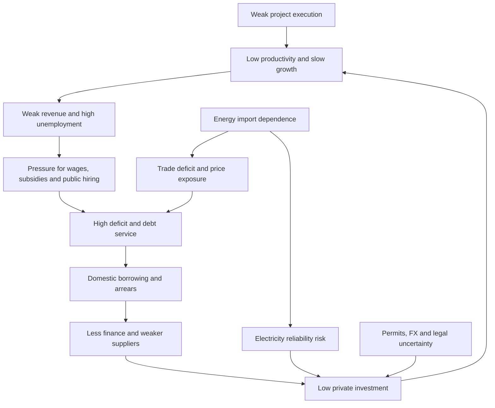

# Diagnosis: what is holding Tunisia back

## The problem is a low-investment equilibrium

Tunisia’s constraints reinforce one another:

The state is asked to protect household purchasing power, employ graduates, finance utilities, support food and fuel prices, service debt and build infrastructure. Because growth and tax capacity are limited, these commitments are financed through borrowing, delayed payments, regulated-price gaps and public-enterprise balance sheets. Those mechanisms then weaken banks, suppliers, utilities and investment.

## Ten binding constraints

### 1. Insufficient productive investment

Declared investment improved strongly in 2025, but the economy still shows low net FDI relative to GDP and insufficient capital deepening. The important gap is between declaration and operation. Land, permits, grid connections, foreign exchange, customs, finance and unpredictable interpretation can stop a project at every stage.

### 2. Electricity and energy insecurity

Gas dependence, weak domestic resources, low flexible capacity, grid bottlenecks, losses and utility finances combine into high system risk. The July events showed that reliability is an economic-policy issue: an outage destroys production, inventory, trust and investment appetite immediately.

### 3. Public spending is rigid

Wages, transfers and interest leave limited room for maintenance and investment. Across-the-board cuts often reduce the flexible categories first, producing lower infrastructure quality while the main rigid commitments remain.

### 4. Debt service and domestic crowding out

Debt is high, but the cash-flow profile is equally important. Large principal repayments require continual refinancing. Heavy domestic borrowing absorbs bank liquidity and reinforces the link between sovereign and banking risk.

### 5. Public enterprises carry hidden fiscal policy

Public enterprises provide essential services and often charge regulated prices or perform social obligations. When the budget does not compensate transparently, the result appears as arrears, supplier debt, bank borrowing or under-maintenance. This hides the policy cost and damages operations.

### 6. Generalized support is poorly targeted

Fuel and basic-goods subsidies protect households, but benefits are not proportional to need. Broad subsidies also encourage consumption, smuggling or inefficient technology and expose the budget to world prices. Reform fails politically and economically when compensation is promised after prices rise rather than delivered before.

### 7. Policy and regulatory uncertainty

Investors can adapt to demanding rules more easily than to uncertain rules. Slow approvals, unclear foreign-exchange access, changing interpretations and weak appeal mechanisms increase the option value of waiting. The pending foreign-exchange code is an example: delay itself has a cost.

### 8. Skills are disconnected from demand

High graduate unemployment beside employer skill shortages indicates mismatch, weak job creation, or both. Training institutions are often rewarded for enrollment and completion, not sustained placement and productivity.

### 9. Regional infrastructure and opportunity are uneven

Interior regions face weaker transport, utilities, market access and service delivery. Tax incentives alone cannot offset unreliable infrastructure and small local supplier networks. Regional policy must finance connections and capabilities, not only designate zones.

### 10. Delivery and transparency are weak

Tunisia has many plans and financing commitments. Public reporting often stops at announcement, loan signature or tender launch. Without a single project pipeline and operational dashboards, delays are discovered late and responsibility remains diffuse.

## What is not the diagnosis

### “Tunisia only needs austerity”

An abrupt contraction would reduce demand, investment and service quality, and could worsen debt dynamics through lower growth. Fiscal adjustment is necessary, but its composition and sequencing determine whether it works.

### “Tunisia only needs more borrowing”

Borrowing can finance high-return infrastructure and smooth adjustment. It cannot make a loss-making recurrent structure sustainable. Loans without delivery increase debt and foreign-exchange exposure.

### “Renewables alone will end outages”

Solar and wind reduce fuel imports and costs, but reliability also requires networks, storage, flexible capacity, demand response and operating discipline.

### “Privatization alone will fix public enterprises”

Ownership change is neither necessary nor sufficient. The immediate needs are clear objectives, transparent accounts, professional governance, enforceable service standards and explicit public-service compensation. Competition or private participation should be chosen function by function.

### “Tax incentives create investment”

Incentives cannot compensate for unreliable electricity, blocked transfers, slow customs, uncertain permits or weak courts. They also erode revenue and create unequal treatment. Investment policy should focus first on predictable operating conditions.

### “Price controls solve inflation”

Controls can temporarily suppress recorded prices, but shortages, quality decline, fiscal transfers and informal markets shift the cost. Competition, supply, logistics, targeted transfers and credible monetary-fiscal policy are more durable.

## The correct sequencing

The reform sequence should satisfy four tests:

1. **Operational first:** prevent avoidable outages, water interruptions and payment disruption.
2. **Protection before price adjustment:** beneficiary data and cash delivery must work before subsidies are reduced.
3. **Transparency before risk transfer:** disclose liabilities and performance before PPPs, guarantees or restructuring.
4. **Infrastructure before promotion:** deliver power, water, logistics and approvals before offering more tax incentives.

## A realistic objective

The objective is not to reach a perfect textbook model. It is to move Tunisia from a cycle of shortage, hidden liabilities and low investment to a cycle in which:

- utilities provide reliable service and recover transparent costs;
- vulnerable households receive direct, dependable protection;
- the budget records the true cost of policy;
- banks finance firms rather than an ever-larger state requirement;
- investment decisions receive predictable treatment;
- completed infrastructure lowers import costs and raises exports; and
- growth creates enough fiscal space to reduce debt without damaging essential services.
