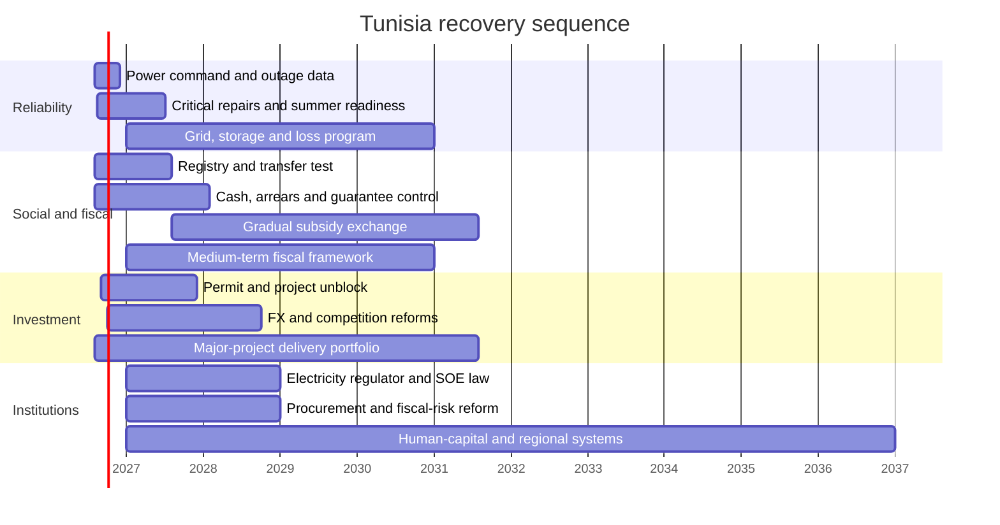

# Short-, medium- and long-term recovery program

## Design principles

The program follows six rules:

1. **Reliability before restructuring.** Keep electricity, water, health, payments and logistics working while reforms are designed.
2. **Compensation before price change.** A targeted transfer must be paid successfully before a broad subsidy is reduced.
3. **Reallocation before aggregate cuts.** Protect maintenance, productive capital and high-impact social services.
4. **Competition before incentives.** Fix entry, approvals, finance and infrastructure before granting new tax privileges.
5. **Disclosure before risk.** Publish fiscal and project exposure before guarantees, PPPs or emergency contracts.
6. **Measured delivery before scale.** Pilot, evaluate and expand when results are verified.

## Phase I: stabilization and credibility, 0–18 months

### Objective

Prevent electricity and fiscal stress from becoming a broader economic crisis, protect vulnerable households, and make the state’s operating position observable.

### Workstream A — electricity reliability

| Time | Action | Lead | Test of completion |
|---|---|---|---|
| 0–30 days | National reliability cell and daily dashboard | Energy Ministry/STEG | Daily peak, availability, imports, reserve and outages published |
| 0–30 days | Critical-load register | STEG, Health, Water, Interior, telecom regulator | 100% of critical sites tested |
| 0–100 days | Plant/substation constraint audit | STEG with independent engineers | Ranked repair plan with cost and MW/MWh impact |
| 0–100 days | Voluntary demand-response procurement | STEG | Contracted MW and activation rules disclosed |
| 0–6 months | Public-sector bill reconciliation | Finance Ministry/STEG | Undisputed amounts netted; payment plans signed |
| 0–12 months | Outage management and interval metering priority feeders | STEG | Customer-minutes and unserved energy measured |
| Before summer 2027 | Firm seasonal reserve plan | STEG/regulator-designate | Stress test passes for base and severe-heat cases |

**Do not:** impose unexplained cuts; sign long opaque emergency power contracts; disconnect essential public services without continuity arrangements; or treat installed solar MW as firm evening capacity.

### Workstream B — fiscal cash, debt and arrears

1. Create a weekly cash and debt committee chaired by the Finance Ministry.
2. Publish a monthly fiscal dashboard no later than 30 days after month-end.
3. Produce a 13-week cash forecast and a 12-month debt-maturity calendar.
4. Complete an arrears census across central government, municipalities and major public enterprises.
5. Stop accumulation by requiring commitment controls before procurement.
6. Publish all state guarantees, beneficiary, amount, currency, maturity and expected loss.
7. Defer new low-readiness projects; protect maintenance, project completion and import-saving infrastructure.
8. Publish any use of the exceptional BCT facility and an exit schedule.

**Fiscal triage rule:** when cash is short, pay wages and targeted transfers, essential medicines and food, electricity/gas inputs, critical maintenance and verified completed works before low-readiness expansion or new discretionary programs.

This rule is not a legal creditor ranking. It is an operating proposal that must be reconciled with contractual and statutory obligations.

### Workstream C — household protection

Build one delivery system for cash support rather than separate schemes that cannot be reconciled.

- Update the social registry using income, household composition, disability, location and verified consumption indicators.
- Provide an appeal and correction mechanism in every delegation.
- Offer bank, postal and mobile payment options.
- Run a shadow-payment test before subsidy changes.
- Define a lifeline quantity for electricity and, where applicable, water.
- Index transfers partially to food and energy inflation during the transition.
- Publish coverage, payment success, errors of exclusion and household energy burden.

**Go/no-go condition:** no administered energy-price step should occur until at least 95% of eligible beneficiaries have a valid payment channel and two test cycles meet the payment-success standard.

### Workstream D — food inflation and supply

The short-term goal is to protect consumption without creating shortages.

- Publish wholesale and retail price spreads for key staples.
- Intensify competition and anti-collusion enforcement using transaction data.
- Simplify legitimate import procedures when domestic shortages are verified.
- Improve grain, cold-chain and market logistics.
- Pay state suppliers on time.
- Target anti-speculation enforcement at documented conduct rather than broad uncertainty.
- Avoid export bans or price freezes without a time limit, impact assessment and compensation mechanism.

### Workstream E — investment unblock

Create a 100-project unblock list based on capital, jobs, exports, energy savings and readiness. For each project, publish:

- current stage;
- blocking decision;
- institution and official responsible;
- legal deadline;
- next step;
- expected investment and jobs; and
- actual completion outcome.

An investor should submit one digital file. Agencies should exchange data rather than request the same document repeatedly. Rejection must state the legal basis and appeal route. Low-risk approvals can use silence-as-consent; safety, labor, environmental, land and critical-infrastructure decisions require explicit approval.

### Workstream F — SMEs and credit

- Focus guarantees on additional, viable credit rather than existing bank clients.
- Price guarantee fees by risk and publish loss performance.
- Use digital invoices and purchase orders to support working-capital underwriting.
- Enforce public-sector payment deadlines.
- Establish a rapid restructuring route for viable firms in temporary distress.
- Publish new private-sector lending excluding sovereign and public-enterprise exposure.
- Connect concessional green credit to verified energy savings.

### Workstream G — jobs and training

- Convert training procurement from “seats completed” to “sustained placement after 6 and 12 months.”
- Create apprenticeships co-designed and co-financed by employers.
- Add short conversion courses in industrial maintenance, grid work, solar/storage, water systems, logistics, software testing, cybersecurity, languages and export sales.
- Require major public projects to publish skill needs and local-supplier opportunities.
- Finance safe transport and childcare pilots in industrial and service zones with low female participation.

## Phase II: structural transformation, 18 months–5 years

### Objective

Lower the cost and risk of producing in Tunisia, restore fiscal space, scale private investment and create formal jobs.

### Energy and electricity

1. Establish an independent electricity regulator.
2. Publish a ten-year least-cost generation and network plan, updated annually.
3. Maintain a rolling auction calendar for solar, wind, storage and flexibility.
4. Use standardized PPAs and connection agreements.
5. Make connection capacity, queue position and studies public.
6. Install smart meters for large, public and high-loss customers.
7. Introduce time-of-use tariffs for capable users.
8. Reduce technical and commercial losses with feeder-level accountability.
9. Restructure STEG’s cross-debts and place it under a five-year performance contract.
10. Commission ELMED under domestic-security and transparent market rules.

**Economic rule:** choose projects by avoided system cost and reliability contribution, not headline tariff or installed MW alone.

### Fiscal system

#### Revenue

- Complete e-invoicing and risk-based tax audit.
- Connect customs, tax, social-security, land and company data subject to privacy and due-process rules.
- Publish every tax expenditure with legal basis, beneficiary class, cost and sunset.
- End repeated general tax amnesties.
- Simplify small-business formalization with a turnover-based regime and digital filing.
- Strengthen transfer pricing and beneficial-ownership capacity for high-risk cases.

#### Expenditure

- Use three-year expenditure ceilings consistent with the Organic Budget Law.
- Publish program objectives and outcomes, not only execution rates.
- Protect maintenance and high-return capital spending.
- Replace across-the-board cuts with service redesign.
- Control payroll through verified headcount, retirement replacement rules, redeployment and digital workflows.
- Make every new permanent program identify a permanent funding source.

#### Subsidies

- Move electricity, fuel and selected food support toward targeted transfers.
- Retain a lifeline block and public-transport support.
- Publish the distributional impact before each step.
- Allocate savings by a pre-announced formula among transfers, debt and investment.
- Adjust gradually and pause if poverty or inflation safeguards are breached.

### Public enterprises

Classify enterprises into:

- strategic natural-monopoly or essential-service entities;
- commercial enterprises expected to compete and earn a return;
- entities performing an explicit public-service obligation; and
- entities with no continuing public rationale.

For the first three categories:

- appoint professional boards through a transparent process;
- publish audited financial statements;
- separate commercial and policy accounts;
- sign measurable performance contracts;
- disclose debt, guarantees, arrears and procurement;
- pay budget compensation for mandated below-cost service; and
- enforce restructuring milestones before new guarantees.

For non-strategic entities, options may include merger, concession, minority investment, sale, employee/community transition or orderly closure. The decision should follow public valuation and competition analysis, not an ideological default.

### Finance and capital

- Reduce the sovereign’s share of new domestic bank financing as external concessional disbursement and fiscal adjustment take effect.
- Develop longer-term dinar instruments and non-bank institutional demand.
- Improve secured-transactions and movable-collateral practice.
- Modernize insolvency with an early restructuring procedure and specialized commercial capacity.
- Create a transparent co-investment platform for diaspora and institutional capital.
- Expand equity and quasi-equity for SMEs rather than using debt for every business need.
- Allow legitimate exporters operational foreign-currency accounts under risk-based rules.

### Trade and productive sectors

Tunisia should focus on capabilities with existing foundations:

#### Electrical, mechanical, automotive and aerospace components

- supplier certification and quality labs;
- engineering and maintenance skills;
- renewable electricity traceability;
- customs speed and logistics reliability;
- local supplier development around anchor investors.

#### Pharmaceuticals and medical products

- predictable registration and procurement;
- bioequivalence and quality capacity;
- regional export pathways;
- clinical and health-data safeguards.

#### Digital and business services

- workable foreign-currency rules;
- cross-border contracting and payment;
- data protection and cybersecurity;
- advanced language and commercial skills;
- startup scale-up rather than only formation.

#### Agrifood

- water-efficient crops;
- cold chain and storage;
- traceability, certification and branding;
- packaging and processed exports;
- farmer aggregation with competition safeguards.

#### Tourism

- higher-value cultural, nature, health and conference products;
- water and energy efficiency;
- destination transport and urban quality;
- workforce retention and digital distribution.

#### Phosphate and mining

- rail and port reliability;
- transparent operating and environmental data;
- higher-value processing where water, energy and market economics support it;
- community benefit and remediation mechanisms.

### Regional development

Replace dispersed tax incentives with regional service packages:

- reliable power, water and broadband;
- serviced industrial land with clear title;
- transport to employment zones;
- supplier-development centers;
- university and vocational partnerships;
- health, childcare and housing access; and
- local project-preparation capacity.

Publish per-capita capital allocation and execution by governorate. The objective is not equal spending in every year; it is transparent need, readiness, access and outcome.

### Water and climate

- reduce network leakage before expanding supply wherever economical;
- scale smart metering and pressure management;
- price nonessential high-volume use progressively;
- protect a basic household allocation;
- expand treated-wastewater reuse with quality monitoring;
- enforce groundwater abstraction limits;
- connect desalination to lower-carbon electricity;
- use drought triggers for crop, reservoir and emergency-supply decisions; and
- require climate stress tests for all major infrastructure.

## Phase III: resilience and convergence, 5–15 years

### Objective

Raise potential growth, reduce debt and import dependence, and make the economy resilient to climate, demographic and technology shocks.

### Long-term outcome targets

These are proposed national ambitions, not forecasts:

| Outcome | 2030 direction | 2035 ambition | 2040 ambition |
|---|---|---|---|
| Real growth | Sustain above 3.5% | 4–5% range | Maintain with productivity |
| Public debt | Below 78% of GDP | Below 70% | Risk-resilient maturity structure |
| Fiscal deficit | Toward 3% | Near debt-stabilizing balance | Countercyclical capacity |
| Total unemployment | Clear decline | Below 12% | Converge further |
| Youth unemployment | Below 30% | Below 25% | Further convergence |
| Electricity reliability | Regional benchmark trajectory | High-reliability system | Climate-resilient system |
| Renewable electricity | TEREG target achieved and scaling | 40–50%, system-dependent | Higher with firm flexibility |
| Water losses | Audited decline | International peer trajectory | Sustainable utility levels |
| Net FDI | Above 2% of GDP | 3% or more with quality test | Stable diversified flow |

### Human capital

1. Guarantee foundational literacy, numeracy and digital competence by the end of basic education.
2. Publish school-level learning improvement while protecting student privacy.
3. Give technical institutions autonomy tied to employer and placement outcomes.
4. Fund applied research through competitive industry partnerships.
5. Create return and circulation routes for diaspora researchers, engineers and executives.
6. Make lifelong reskilling portable through accredited short credentials.

### Innovation and state capability

- Establish interoperable digital public infrastructure for identity, payments, business and permits.
- Use open standards and avoid vendor lock-in.
- Build a professional senior civil service and project-management track.
- Strengthen statistics and administrative data independence.
- Fund regulators and courts adequately.
- Make policy consultation and regulatory-impact analysis routine.
- Use sunset clauses and post-implementation review for major economic regulations.

### Cities, logistics and land

- integrate housing, transit and employment planning;
- modernize conventional rail and freight before or alongside high-speed expansion;
- digitize ports, customs and cargo community systems;
- clarify land title and valuation;
- capture part of land-value gains around infrastructure;
- require lifecycle maintenance budgets; and
- plan heat, flood and coastal resilience.

## Cross-cutting “stop doing” list

Tunisia should stop relying on:

- undisclosed rolling power cuts;
- emergency procurement without post-award transparency;
- new public programs without funding;
- arrears as an informal financing mechanism;
- broad subsidies without incidence data;
- tax exemptions without cost and sunset;
- project announcements without readiness;
- loan signature as a delivery metric;
- guarantees without expected-loss reporting;
- compulsory or captive bank finance;
- repeated exceptional monetary financing;
- training measured only by enrollment;
- job promises counted before operation; and
- laws without implementing texts, deadlines and appeals.

## Sequencing map

The dates after the evidence cut-off are proposed. Legislative and procurement timing will depend on consultation and constitutional procedure.

## Why this program can work

The early measures improve service and information without waiting for a complete legal overhaul. Targeted protection creates room for gradual price correction. Fiscal transparency lowers hidden risk. Grid and water investments reduce two of the largest production constraints. Better project execution converts already-approved finance into assets. Lower state absorption of bank credit and clearer foreign-exchange rules allow firms to invest. Over time, higher productivity and exports make debt reduction less dependent on cuts.

The program is deliberately conditional. If transfers fail, price reform pauses. If a PPP does not pass affordability review, it does not proceed. If a strategic project lacks a robust demand case, it is redesigned. If debt stress rises, low-readiness expansion is deferred while critical maintenance and social protection are preserved.
