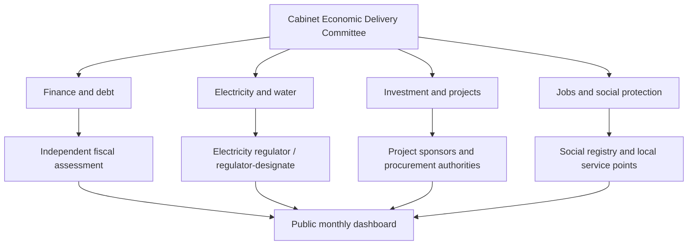

# Implementation, financing and scorecard

## Governance model

The plan needs one public delivery system, not another strategy document.

### Cabinet Economic Delivery Committee

Meet monthly and publish decisions within seven days. Membership should include the Head of Government, Finance, Economy and Planning, Energy, Industry, Employment, Social Affairs, Agriculture/Water, Transport, BCT for relevant non-fiscal matters, STEG and other implementing entities. The committee resolves cross-government issues but does not replace legal authorities.

### Technical secretariat

A small professional unit should:

- maintain the action register;
- verify evidence;
- escalate missed decisions;
- publish the dashboard;
- support project gateway reviews; and
- commission independent evaluations.

Ministries remain accountable for delivery. The secretariat should not become a parallel administration.

### Parliament and public audit

Parliament should receive quarterly reports on debt, guarantees, TEREG, ELMED, water, major projects, public-enterprise risk and use of the BCT facility. The Court of Audit should have data access and resources for rapid performance and procurement audits.

## First 100-day delivery contract

| Commitment | Day 30 | Day 60 | Day 100 |
|---|---|---|---|
| Electricity reliability | Daily dashboard and protected-load list | Constraint audit draft | Repair, demand-response and summer plan funded |
| Fiscal control | Cash committee and guarantee register | Arrears stock draft | Payment and clearance plan |
| Social protection | Registry/data gap report | First shadow payment | Two payment tests and appeals operational |
| Investment unblock | 100-project list | Blocker decisions published | Conversion dashboard live |
| Major projects | Portfolio classification | Readiness gateway applied | Revised priority and disbursement schedule |
| Public enterprises | Top-risk entity list | Cross-debt reconciliation | Draft performance contracts |
| Legal program | Drafting teams and timetable | Consultation texts | Cabinet-ready priority instruments |

## Financing map

The reform program should combine reallocation, concessional finance and private capital. It should not assume that every action needs new sovereign debt.

| Use | Best-fit financing | Conditions |
|---|---|---|
| Critical grid repairs and digital systems | TEREG, STEG capex, concessional loans | Published procurement and reliability outcomes |
| Renewable generation | Competitive private IPP capital | Bankable PPA, grid readiness, contingent-liability disclosure |
| Battery storage/flexibility | Competitive service contracts, climate finance | Availability payments tied to delivered performance |
| Household energy support | Budget funded from phased subsidy savings | Transfer paid before tariff adjustment |
| Energy efficiency | Revolving finance, ESCO contracts, green credit | Verified savings and consumer protection |
| Water networks and Zarat | World Bank program, SONEDE, budget | Leakage and energy metrics |
| Major transport works | Concessional lenders, public capital, selective PPP | Independent economic and fiscal appraisal |
| SME credit | Bank capital plus partial guarantee | Additionality, risk pricing, published losses |
| Training/apprenticeship | Budget, employer co-finance, development partners | Payment partly tied to sustained placement |
| Arrears clearance | Cash management, asset/debt netting, budget | Verified claims and no new accumulation |
| Public-enterprise restructuring | Budget, asset optimization, development finance | Audited plan and performance milestones |

## Resource-allocation rule

Every dinar freed by subsidy reform or above-baseline revenue should be reported under a transparent allocation formula. A starting proposal is:

- 40% targeted household protection and transition support;
- 30% debt and arrears reduction;
- 30% grid, water, maintenance and high-return investment.

This is a policy proposal, not an estimate of available savings. The formula should be adjusted after distributional analysis and financing conditions, but the actual allocation should remain published.

## National scorecard

### Macroeconomic and fiscal

| KPI | Baseline | 12–18 month target | 2028 target | 2030/35 direction |
|---|---:|---:|---:|---:|
| Real GDP growth | 2.5% in 2025; 2.5% WB forecast 2026 | Avoid downside; improve private investment | Above baseline forecast | Sustain >3.5% by 2030; 4–5% ambition by 2035 |
| Overall fiscal balance | −5.2% GDP in 2025; −6.1% WB forecast 2026 | On published correction path | Below 4% | Toward 3% by 2030 |
| Public debt | 82.1–82.2% GDP at end-2025 | Stabilize below 84% | Declining | <78% by 2030; <70% ambition by 2035 |
| Arrears | Publish verified stock | No net new arrears | At least 50% reduction | Normal payment terms |
| Guarantee exposure | TND 7bn 2026 authorization ceiling | Complete registry and expected loss | Declining high-risk concentration | Risk-priced portfolio |
| Capital execution | Establish comparable baseline | +10 percentage points for priority portfolio | At least 85% | High, without cost inflation |

### External liquidity and banking

| KPI | Baseline | 12–18 month control | 2028 direction |
|---|---:|---:|---:|
| FX reserve cover | 97 import days, 3 July 2026 | Publish financing calendar; avoid disorderly decline | Rebuild a durable buffer |
| External debt-service coefficient | 16.1% in 2025 | Quarterly stress test | Declining risk concentration |
| Classified-loan ratio | 14.9% end-2025 | Publish migration and recovery | Sustained decline |
| Classified-loan coverage | 51.6% end-2025 | Bank-level supervisory plan | Sustained improvement |
| Bank public-sector financing | 27.6% of assets end-2025 | Publish concentration and new-flow split | Reduce crowding-out risk |
| Medium- and long-term credit | TND 61.12bn; +0.7% in 2025 | Increase viable productive new lending | Stronger maturity profile |

### Electricity and energy

| KPI | Baseline | 12–18 month target | 2028 target |
|---|---:|---:|---:|
| Customer-minutes interrupted | Establish 2026 feeder baseline | −25% | −50% |
| Unserved energy | Establish 2026 baseline | −25% | −50% |
| Peak reserve reporting | Not found publicly | Daily seasonal reporting | Continuous reporting |
| Critical-site backup test | Establish in 30 days | 100% pass or remediation plan | Annual pass |
| Renewable production share | About 9% Jan–May 2026; TEREG program baseline 5.6% | Commission awarded projects and reconcile definitions | 27% official TEREG target |
| New solar/wind | Program baseline | Connection milestones | +2.8 GW official TEREG target |
| STEG cost recovery | 60% TEREG baseline | Measured improvement | 80% TEREG target |
| Network losses | Publish audited baseline | −1 percentage point | At least −2 points |
| Energy independence | 34% Jan–May 2026 | Stabilize | Clear improvement |

Targets for outage reduction and loss reduction are proposed and should be recalibrated from audited baselines. TEREG capacity, renewable-share and cost-recovery figures are official program targets. Its 5.6% renewable baseline is not directly comparable with the January–May 2026 production share without reconciling period and definition.

### Investment and projects

| KPI | Baseline | 18-month target | 2028 target |
|---|---:|---:|---:|
| Declared-to-operational conversion | Not published | Cohort dashboard operating | Annual improvement |
| Median low-risk permit time | Establish | −50% | Peer benchmark |
| Grid-connection queue | Not publicly complete | 100% published | Statutory deadlines met |
| Net FDI | 1.6% GDP WB estimate 2025 | At least forecast trajectory | >2% with diversification |
| Priority-project capital execution | Establish | +10 points | ≥85% |
| Contract cost growth | Establish | Every variation published | Median within approved tolerance |
| Supplier payment time | Establish | <60 days | <30 days |

### Jobs and inclusion

| KPI | Baseline | 18-month target | 2030/35 direction |
|---|---:|---:|---:|
| Unemployment | 15.0% Q1 2026 | Downward trend | <12% ambition by 2035 |
| Youth unemployment | 37.5% | Downward trend | <30% by 2030; <25% ambition by 2035 |
| Graduate unemployment | 24.2% | Placement-focused programs | Sustained reduction |
| Female graduate unemployment | 32.0% | Close program access and placement gap | Converge materially |
| Apprenticeship placement | Establish | ≥70% employed at 6 months in validated programs | Scale only successful programs |
| Social-transfer payment success | Establish in pilot | ≥95% | ≥98% |
| Exclusion-error resolution | Establish | 90% within 30 days | 95% |
| Real median earnings | Not published currently | Publish baseline | Positive real growth |
| Household energy burden | Not published by income decile | Baseline before tariff reform | No rise for protected groups |

### Water and climate

| KPI | Baseline | 18-month target | 2028 target |
|---|---:|---:|---:|
| Potable-water physical losses | 23% project baseline; publish by system | Metering and repair program | Sustained audited decline |
| Public-irrigation physical losses | 30% project baseline | Audited scheme baselines | Sustained audited decline |
| Dam filling | About 60% in June 2026 | Monthly storage and allocation reporting | Multi-source resilience |
| Service interruption | Establish | Public event log | Material reduction |
| Energy per m³ desalinated | Establish | Published monthly | Declining |
| Treated-water reuse | Establish | Project pipeline | Increased with quality compliance |
| Major projects climate-tested | Partial/unknown | 100% of new major appraisals | 100% pipeline |

### State-owned enterprises

| KPI | Baseline | 12–18 month target | 2028 target |
|---|---:|---:|---:|
| Bank credit to public enterprises | TND 16.60bn end-2025 | Entity and maturity disclosure | Declining concentration risk |
| Consolidated SOE debt | Not published currently | Audited register | Annual reduction for high-risk entities |
| Outstanding guaranteed SOE debt | Not published currently | Quarterly registry and expected loss | Risk-priced portfolio |
| Government–SOE cross-arrears | Not published currently | Reconcile and stop net accumulation | Normal payment terms |
| Supplier payment delay | Not published | <60 days | <30 days |
| Audited accounts filed on time | Not published as portfolio rate | 100% publication or named exception | 100% |

## Indicator rules

Every KPI must have:

- one responsible institution;
- a written definition;
- a baseline date;
- source system;
- publication frequency;
- revision policy;
- independent-verification route; and
- target status: official, contractual or proposed.

Targets without definitions invite gaming. For example, “installed renewable capacity” should not substitute for available energy, and “jobs announced” should not substitute for employees on payroll after operation.

## Decision triggers

### Electricity emergency trigger

If forecast reserve falls below the approved reliability threshold:

1. activate contracted demand response;
2. secure imports;
3. defer noncritical maintenance;
4. notify large users and the public;
5. protect critical loads;
6. use controlled rotation only as the final operational measure; and
7. publish the event review within seven days.

### Fiscal trigger

If revenue, financing or energy-subsidy cost deviates materially:

1. publish a revised forecast;
2. stop new low-priority commitments;
3. protect social transfers, maintenance and high-return projects;
4. adjust the borrowing plan;
5. submit a supplementary budget when the statutory threshold is met.

### Social safeguard trigger

Pause the next subsidy or tariff step if:

- eligible payment success falls below 95%;
- food or energy poverty rises beyond the agreed band;
- appeal backlogs exceed the service limit; or
- inflation materially exceeds the stabilization scenario because of the reform.

### Debt trigger

If the debt ratio, gross financing need or reserve coverage breaches the downside threshold:

- defer low-readiness foreign-currency projects;
- accelerate concessional refinancing;
- limit new guarantees;
- preserve export- and import-saving projects;
- update the debt strategy; and
- disclose the correction path.

## Independent evaluation schedule

- **Monthly:** operational dashboards and fiscal execution.
- **Quarterly:** major projects, guarantees, arrears, TEREG and social safeguards.
- **Annually:** debt strategy, fiscal risks, tax expenditures, public-enterprise results, competition and investment conversion.
- **At project midpoint:** independent delivery and economic review.
- **Two years after completion:** benefits, usage, operating cost, jobs and regional effect.
- **Every three years:** legal and regulatory post-implementation review.

## Communications

Public communication should state:

- the problem and evidence;
- what government will do;
- who is protected;
- what changes and when;
- what households and firms can appeal;
- the measured result; and
- what happens if safeguards fail.

It should not promise that one loan, project or law has solved the system. Credibility is built when the same dashboard shows both improvement and missed targets.
