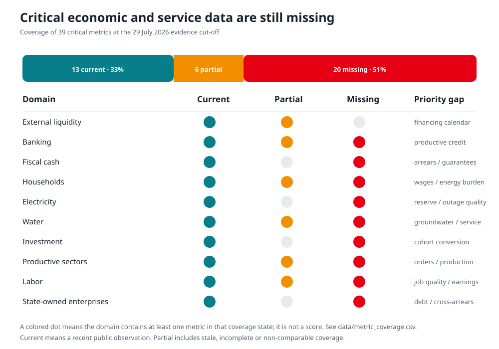
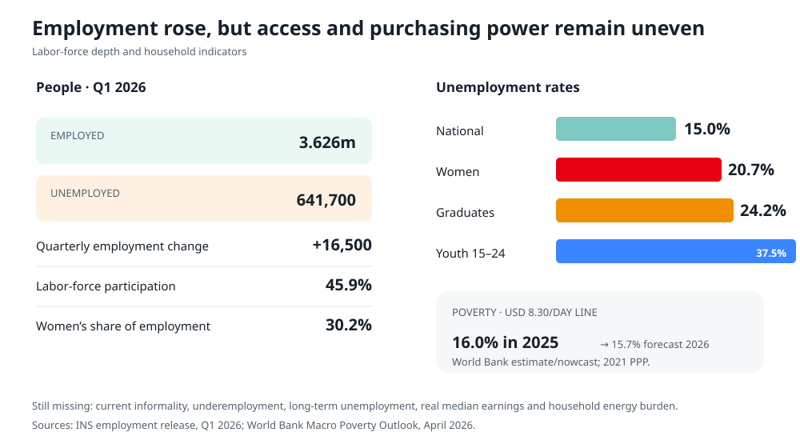
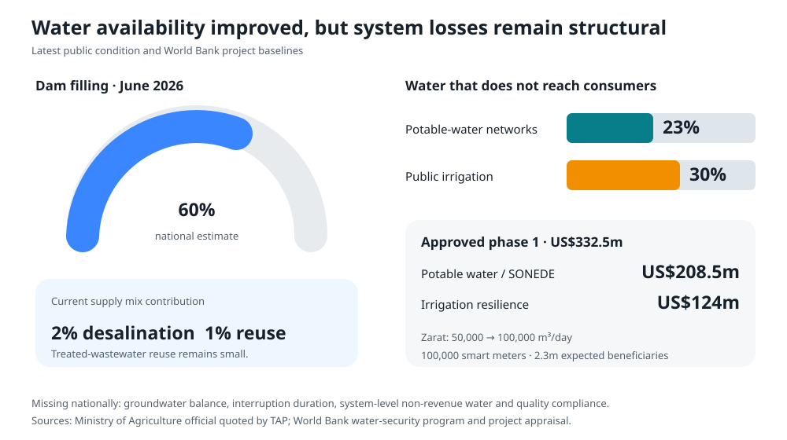

# Critical metrics and system-risk dashboard

## What this chapter adds

Headline GDP, inflation, unemployment, debt and investment figures are necessary but not sufficient. A country can show improving growth while losing foreign-exchange cover, accumulating payment arrears, weakening utility service, directing bank credit toward the public sector or leaving households exposed to food and energy costs.

This chapter adds ten connected monitoring blocks:

1. external liquidity;
2. banking stability and credit allocation;
3. fiscal cash and contingent liabilities;
4. household welfare;
5. electricity reliability;
6. water security;
7. investment execution;
8. productive sectors and foreign-currency earners;
9. labor-market depth; and
10. state-owned-enterprise risk.

It also records which metrics were not available from a current public source. Missing data are treated as a governance risk, not as zero.

Of the 39 critical measures in the coverage audit, 13 had a current public observation, six were only partially covered and 20 were missing. “Partial” includes a project baseline without a recurring national series, a release without enough detail, or a figure that is not comparable across institutions.

## System-risk summary

| Block | Latest signal | Risk reading | Most important missing measure |
|---|---|---|---|
| External liquidity | Reserves: TND 24.54bn and 97 import days on 3 July 2026 | Buffer declined from 121 days at end-2024 | Monthly external financing and debt-maturity calendar |
| Banks | NPL ratio 14.9%; solvency 15.1%; LCR 252.8% at end-2025 | System ratios are adequate, but asset quality and public exposure are material | New productive private credit by maturity and borrower type |
| Fiscal cash | 2026 gross financing need: TND 27.06bn | Large refinancing requirement and domestic-market dependence | Arrears stock, outstanding guarantees and actual BCT-facility use |
| Households | Food inflation 7.1% in June 2026; 2025 poverty nowcast 16.0% at the USD 8.30 line | Headline disinflation does not remove distributional pressure | Real wages and energy burden by income decile |
| Electricity | 34% energy independence; 91% gas generation through May | Import dependence and limited visible operating margin | Peak demand, available capacity, reserve, SAIDI, SAIFI and unserved energy |
| Water | Dam filling near 60% in June; estimated physical losses 23% potable and 30% irrigation | Better rainfall does not repair leakage, groundwater pressure or service inequality | Groundwater balance, interruption duration and quality compliance |
| Investment | 2025 GFCF TND 26.76bn; FDI TND 3.51bn | Improvement is real, but declarations still lack cohort conversion evidence | Declared-to-operational conversion and public-project execution |
| Productive sectors | H1 exports TND 34.65bn; tourism receipts TND 3.35bn | Export and tourism inflows help, while energy imports and weak production data limit the view | Export orders, industrial detail and monthly phosphate output |
| Labor | Employment 3.626m; unemployment 641,700 in Q1 | Employment rose, but access and job quality remain weak | Informality, underemployment, duration and real earnings |
| SOEs | Bank credit to public enterprises TND 16.60bn | Fiscal, banking and supplier risks are connected but not consolidated | Entity-level debt, guarantees, transfers and cross-arrears |

## 1. External liquidity

Net foreign-exchange reserves declined from TND 27.33bn and 121 import days at end-2024 to TND 25.12bn and 106 days at end-2025. The latest reviewed observation, 3 July 2026, was TND 24.54bn and 97 days. The fall does not by itself prove a balance-of-payments crisis, but it reduces the space available to absorb an energy-price shock, weak tourism season, delayed external loan or unusually heavy maturity period.

Foreign-currency earners remain important:

- workers’ income receipts reached TND 11.44bn in 2025, up 15.2%;
- the financial-transfer component reached TND 8.79bn;
- tourism receipts reached TND 3.35bn in the first half of 2026, about 4.4% above the same period of 2025; and
- combined tourism receipts and workers’ remittances exceeded TND 9bn by 20 July 2026.

The 2025 current-account deficit was estimated at 2.3% of GDP by the BCT. The World Bank’s estimate is 2.4%, which illustrates a normal timing and methodology difference. Long-term external debt stood at TND 68.16bn at end-2025, while long-term external debt service during the year was TND 12.45bn.

### Required monthly view

The reserve stock should be published with:

- import cover;
- scheduled public and publicly guaranteed external principal and interest for the next 12 months;
- confirmed versus expected external disbursements;
- energy-import payments;
- tourism and remittance receipts;
- the current-account balance; and
- EUR/TND, USD/TND and real-effective-exchange-rate movements.

The objective is not to target a daily exchange rate. It is to identify whether reserve movements are seasonal, financing-related or structural.

## 2. Banking stability and allocation

End-2025 banking-sector ratios show both resilience and concentration risk:

- solvency ratio: 15.1%;
- Tier 1 capital ratio: 12.1%;
- liquidity coverage ratio: 252.8%, up from 223.3%;
- loan-to-deposit ratio: 92.1%, down from 96.2%;
- classified-loan ratio: 14.9%, up from 14.5%;
- classified-loan coverage: 51.6%, up from 50.5%; and
- classified loans for private enterprises: 20.8%.

Loans to the economy reached TND 122.95bn. Short-term lending grew 5.6%, while medium- and long-term lending grew only 0.7%. Credit to public enterprises reached TND 16.60bn, up about 14.7%. Banks’ public-sector financing rose from 24.7% to 27.6% of assets, and Treasury bills held by banks reached TND 25.71bn.

The concern is not that every state exposure is impaired. It is that a growing sovereign and public-enterprise share can transmit fiscal risk into banks and reduce the space, maturity and risk appetite available for productive private investment.

### Required quarterly view

The BCT should add:

- new credit, not only outstanding stock;
- private firms separated from public enterprises;
- maturity, currency and interest-rate structure;
- exporting firms, SMEs and first-time borrowers;
- loan applications, approvals and rejection reasons;
- restructured and forborne loans;
- NPL migration and recoveries; and
- bank-by-bank concentration ranges without exposing protected customer data.

## 3. Fiscal cash, arrears and guarantees

Provisional 2025 execution recorded TND 49.70bn of revenue and grants and TND 58.47bn of expenditure. The overall deficit was TND 8.98bn. After adding back TND 6.46bn of interest, the calculated primary deficit was about TND 2.52bn.

The 2026 financing plan is large:

| Financing item | TND bn |
|---|---:|
| Gross government financing need | 27.064 |
| Planned domestic financing | 19.056 |
| Planned external financing | 6.808 |
| Planned Treasury resources | 1.200 |
| Public debt service | 23.057 |

The Finance Law authorizes up to TND 7bn of new state guarantees and a TND 11bn direct BCT facility. These are legal ceilings. They are not evidence that the full amounts have been issued or drawn.

The current public dashboard does not show a consolidated arrears stock, actual BCT-facility drawdown, outstanding guarantee stock, expected guarantee loss or a 2026 capital-execution rate. These omissions prevent a complete assessment of the government’s cash position and fiscal risks.

### Minimum fiscal-risk publication

The Ministry of Finance should publish monthly:

- commitment, payment and cash execution;
- payment arrears by age, creditor type and ministry;
- tax-refund arrears;
- BCT-facility drawdown and repayment;
- debt maturities and auction results;
- outstanding guarantees by beneficiary, currency and maturity;
- guarantee calls, expected loss and fees collected; and
- capital execution for the priority-project portfolio.

Quarterly reports should reconcile government, social-fund, SOE and supplier claims so the same obligation is not counted differently by separate entities.

## 4. Household welfare and distribution

The World Bank nowcasts poverty at the USD 8.30-a-day line at 16.0% in 2025, down from 16.6% in 2024, and forecasts 15.7% in 2026. This is a modeled series at 2021 purchasing-power parity, not Tunisia’s national poverty line.

Real private consumption was estimated to grow 4.3% in 2025 and is forecast to slow to 2.4% in 2026. June headline inflation was 5.3%, but food inflation was 7.1%. That gap matters because lower-income households spend more of their budget on food.

No current public economy-wide real-wage index, household energy burden by income decile, regional food-inflation series or current consumption distribution was found. This is a critical weakness for subsidy and tariff reform. A national average can improve while a vulnerable group loses purchasing power.

### Reform safeguard

Before an electricity, fuel, food or water price adjustment:

1. estimate the cost by income decile and region;
2. identify eligible households in the social registry;
3. run a shadow payment;
4. test payment success and appeals;
5. pay compensation before the price change; and
6. publish the distributional result after implementation.

## 5. Electricity reliability

The energy dashboard shows structural vulnerability: energy independence fell to 34% through May 2026, and natural gas supplied about 91% of domestic electricity generation. The TEREG program aims to raise renewable energy from its program baseline of 5.6% to 27% by 2028, add 2.8 GW of solar and wind, and improve STEG cost recovery from 60% to 80%.

Those targets do not measure daily reliability. The following current national series were not found publicly:

- peak demand;
- available generation at peak;
- operating reserve margin;
- forced generation outages;
- SAIDI and SAIFI;
- energy not supplied;
- current audited transmission and distribution losses;
- collection rate by customer class; and
- STEG receivables and cross-arrears.

Without these figures, a summer interruption cannot be cleanly separated into insufficient generation, transmission congestion, distribution faults, fuel limits or preventive rotation.

### Required operating dashboard

STEG should publish a daily system card with peak demand, available generation, imports, reserve, renewable curtailment, planned maintenance and emergency events. A monthly service report should provide national and regional SAIDI, SAIFI, unserved energy, losses, collections and an event review for major outages.

## 6. Water security

The national dam filling rate was estimated at about 60% in June 2026. This is an improvement in available surface storage, not a full measure of water security. Project documents estimate that about 23% of potable water and 30% of water in public irrigation schemes do not reach consumers because of leakage.

Desalination contributes about 2% of current water supply and treated-wastewater reuse about 1%. The approved US$332.5m first phase of the Water Security and Resilience Program includes:

- US$208.5m for potable-water security and SONEDE performance;
- US$124m for irrigation resilience;
- expansion of Zarat desalination from 50,000 to 100,000 m³ per day;
- 100,000 smart meters and network rehabilitation; and
- expected improved service for 2.3 million people.

The missing national measures are groundwater abstraction versus recharge, interruption duration, non-revenue water by distribution system and water-quality compliance. Dam filling alone can therefore give a false sense of security.

## 7. Investment execution

Gross fixed capital formation rose from TND 24.30bn in 2024 to TND 26.76bn in 2025. In real terms, it grew 5.4%, and the investment rate increased from 15.2% to 15.5% of GDP. The BCT forecasts TND 29.98bn and a 16.0% investment rate in 2026.

The 2025 sector split was:

- services: TND 13.69bn, 51.1%;
- industry: TND 7.38bn, 27.6%;
- collective equipment: TND 4.39bn, 16.4%; and
- agriculture: TND 1.31bn, 4.9%.

Realized FDI increased from TND 2.70bn in 2024 to TND 3.51bn in 2025. FDI excluding energy was linked to 921 operations and 14,085 reported jobs. First-quarter 2026 FDI reached TND 824.4m, up 17.2% year on year.

Declared investment reached TND 8.36bn in 2025, but it cannot be divided by realized FDI to produce a valid conversion rate: the concepts, investors and project cohorts differ. Tunisia needs a project identifier that follows a declaration through permit, financing, construction, operation, employment and export results.

## 8. Productive sectors and foreign-currency earners

The main current signals are mixed:

- H1 2026 merchandise exports reached TND 34.65bn, up 9%;
- H1 tourism receipts reached TND 3.35bn;
- 2025 workers’ income receipts reached TND 11.44bn;
- phosphate and derivative exports rose 15% in 2025; and
- the 2026 commercial-phosphate production target is 5.3 million tonnes.

Targets are not output. A consistent monthly physical-production series for phosphate was not found in the reviewed public sources. The INS publishes an industrial-production release calendar, but a stable May value was not retrieved from the reviewed page. Current national tourism receipts are available, while arrivals and overnight stays were not available at the same freshness from the reviewed ONTT source.

The production dashboard should join:

- industrial output by branch;
- export orders and order backlogs;
- electricity and water interruptions affecting producers;
- tourism arrivals, nights, occupancy and receipts;
- phosphate extraction, transport, transformation and exports;
- agricultural output, storage losses and export volumes; and
- freight time and port dwell time.

## 9. Labor-market depth

The first quarter of 2026 had:

- labor force: 4.268 million;
- employment: 3.626 million, up 16,500 from the previous quarter;
- unemployment: 641,700, down 3,500;
- participation: 45.9%;
- female share of employment: 30.2%;
- urban unemployment: 14.4%; and
- rural unemployment: 16.5%.

Services employed 52.9% of workers, manufacturing 19.0%, agriculture and fishing 15.7%, and non-manufacturing activities 12.3%.

The quarterly survey still needs a public companion dashboard for informality, time-related underemployment, long-term unemployment, median real earnings and regional job quality. The unemployment rate alone does not identify workers who have too few hours, unstable work or declining purchasing power.

## 10. State-owned-enterprise risk

SOE risk links the budget, banks, utilities and private suppliers. At end-2025, bank credit to public enterprises reached TND 16.60bn, while the public-sector share of bank assets reached 27.6%. TEREG targets a cumulative TND 2.05bn reduction in STEG subsidies and TND 2.95bn improvement in STEG’s operating net result during 2025–2028. These are program targets, not realized results.

A current consolidated public table was not found for:

- SOE debt;
- guaranteed SOE debt;
- budget transfers by entity;
- SOE arrears to the state and social funds;
- government arrears to SOEs;
- bank exposure by SOE;
- supplier payment delays; and
- timely audited-statement compliance.

The annual state-enterprise report should become a machine-readable quarterly risk register for the largest entities, with audited annual accounts retained as the legal record.

## Data publication program

### First 30 days

- assign an owner and definition to every missing critical metric;
- publish existing administrative data in CSV form;
- create daily reserve and electricity cards;
- publish a preliminary government-arrears and guarantees register; and
- open a correction log for revised figures.

### Within 90 days

- publish the fiscal cash, electricity reliability, water service and SOE risk dashboards;
- link investment declarations to execution identifiers;
- release quarterly productive-credit allocation;
- add household-distribution safeguards to price-reform decisions; and
- establish independent review by the Court of Audit, regulator or designated verifier.

### Within 12 months

- place publication duties in sector regulations and performance contracts;
- require open, non-proprietary machine-readable formats;
- publish historical series and metadata;
- add service-level data by governorate while protecting personal information; and
- report missed publication deadlines to Parliament.

## Alert thresholds

Thresholds should be approved by the responsible institutions after model validation. A practical starting framework is:

| Signal | Watch | Escalate |
|---|---|---|
| Import cover | Below 100 days | Below 90 days or a rapid unexplained fall |
| Gross financing | Material auction or disbursement slippage | Cash rationing, arrears growth or emergency monetary financing |
| Bank asset quality | NPL migration accelerates | Capital or liquidity buffer breaches |
| Electricity | Reserve approaches operating minimum | Controlled rotation or energy not supplied |
| Water | Rapid storage or groundwater deterioration | Drinking-water continuity or quality failure |
| Households | Food inflation materially above headline | Failed compensation, rising poverty or payment exclusion |
| Investment | Permits or disbursements miss schedule | Project loses financing, demand case or fiscal affordability |
| SOEs | New arrears or guarantee concentration | Guarantee call, missed debt service or critical service interruption |

These are monitoring triggers, not automatic policy rules. Each alert should lead to a published diagnosis and a defined response.

## Data files

- [External liquidity](data/external_liquidity.csv)
- [Banking health](data/banking_health_2025.csv)
- [Fiscal cash and risks](data/fiscal_cash_risks.csv)
- [Household welfare](data/household_welfare.csv)
- [Electricity reliability](data/electricity_reliability.csv)
- [Water security](data/water_security.csv)
- [Investment execution](data/investment_execution.csv)
- [Productive sectors](data/productive_sectors.csv)
- [Labor-market depth](data/labour_depth_2026q1.csv)
- [SOE fiscal risk](data/soe_fiscal_risk.csv)
- [Metric coverage audit](data/metric_coverage.csv)

## Principal sources

- [BCT Annual Report 2025](https://www.bct.gov.tn/bct/siteprod/documents/RA_2025_fr.pdf)
- [INS employment and unemployment, Q1 2026](https://www.ins.tn/publication/indicateurs-de-lemploi-et-du-chomage-premier-trimestre-2026)
- [INS industrial-production release page](https://www.ins.tn/node/493)
- [Ministry of Finance provisional 2025 budget execution](https://www.finances.gov.tn/sites/default/files/2026-02/R%C3%A9sultats%20provisoires%20de%20l%27ex%C3%A9cution%20du%20Budget%20%C3%A0%20fin%20D%C3%A9cembre%202025.pdf)
- [World Bank Macro Poverty Outlook, April 2026](https://documents1.worldbank.org/curated/en/099635304152611739/pdf/IDU-5b2c845c-675f-43d2-8411-9d2c38f7624b.pdf)
- [World Bank TEREG appraisal](https://documents1.worldbank.org/curated/en/099031525065039924/pdf/P507304-161c6028-502c-4281-85b6-9e7f219973d9.pdf)
- [World Bank Water Security and Resilience Program](https://www.worldbank.org/en/news/press-release/2026/04/01/tunisia-major-push-to-strengthen-water-security-and-resilience)
- [World Bank irrigation-water project appraisal](https://documents1.worldbank.org/curated/en/099020626172042635/pdf/P511719-ba379039-6898-4c94-ae53-0a713d6fd43a.pdf)
- [TAP on reserves, 3 July 2026](https://www.tap.info.tn/en/Portal-Headlines/20357134-forex-reserves-drop)
- [TAP on tourism receipts, H1 2026](https://www.tap.info.tn/en/Portal-Headlines/20383154-tourism-revenues)
- [TAP on remittances and tourism, 20 July 2026](https://www.tap.info.tn/en/Portal-Economy/20420199-workers)
- [TAP on FDI in 2025](https://www.tap.info.tn/en/Portal-Top-News-EN/19985964-tunisia-over-tnd)
- [TAP on Q1 2026 foreign investment](https://www.tap.info.tn/fr/Portail-%C3%A0-la-Une-FR-top/20168744-hausse-des)
- [TAP on June 2026 dam filling](https://www.tap.info.tn/en/Portal-Economy/20320889-dam-filling-rate-at)

All BCT 2025 figures in this chapter are end-period or full-year measures unless stated otherwise. Project targets, forecasts, estimates and calculated values are labeled separately in the CSV files.
